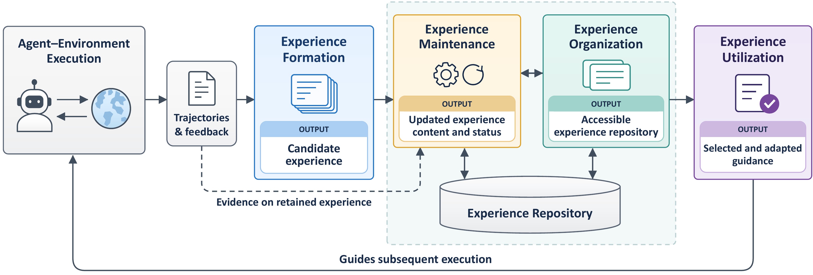

<!-- This file is generated by scripts/build.py from data/papers.yaml and scripts/README.template.md. Edit those, not README.md. -->
<div align="center">

# Awesome Experience-Driven Agents

**A curated list of research on LLM agents that learn from their own task-execution trajectories:<br>how experience is formed, organized, utilized, and maintained.**

[](https://awesome.re)
[](#contents)
[](https://xiaohuiyan.github.io/awesome-experience-driven-agents/)
[](#citation)
[](CONTRIBUTING.md)
[](LICENSE)

**[🔎 Browse and filter on the website](https://xiaohuiyan.github.io/awesome-experience-driven-agents/)**

</div>

This list accompanies our survey **_From Trajectories to Experience: A Survey of Experience-Driven LLM Agents_** (preprint coming soon). It covers the 271 works reviewed in the survey, 69 of which have public code, organized by the survey's taxonomy.

> LLM agents record in their trajectories which strategies failed and how they recovered, yet an agent that resolves a problem in one episode may repeat the same diagnostic detour in the next.
> Work on reflection, agent memory, workflow learning, and skill acquisition addresses this gap under different names.

## What counts as agent experience?

We define **agent experience** as *action-guiding information grounded in task-execution trajectories and retained to guide later episodes where it applies*. It takes three forms:

| Form | What is retained | Examples |
|---|---|---|
| **Trajectory-level** | A trajectory kept as a precedent | RAP, Synapse, JARVIS-1 |
| **Semantic-level** | A lesson, insight, rule, or guideline | Reflexion, ExpeL, AutoGuide |
| **Procedural-level** | A reusable workflow, skill, or program | Voyager, AWM, SkillWeaver |

Methods are reviewed through four **lifecycle functions**:

<p align="center"></p>

- **Formation** selects or derives candidate experience from trajectories.
- **Organization** makes experience accessible.
- **Utilization** applies experience to current decisions or internalizes it into model parameters.
- **Maintenance** admits, consolidates, revises, and retires experience as evidence accumulates.

Each entry below appears under every lifecycle stage it contributes to. Entries are sorted newest first, and the one-line notes summarize how the survey characterizes each work. Systems the survey marks as *adjacent* (general or conversational memory outside its experience scope) are labelled as such in their notes.

## Contents

- [Surveys and Position Papers](#-surveys-and-position-papers)
- [Foundations and Related Directions](#-foundations-and-related-directions)
- [Experience Formation](#-experience-formation)
  - [Trajectory-Level Experience](#trajectory-level-experience)
  - [Semantic-Level Experience](#semantic-level-experience)
  - [Procedural-Level Experience](#procedural-level-experience)
- [Experience Organization](#-experience-organization)
  - [Flat Organization](#flat-organization)
  - [Tree-Structured Organization](#tree-structured-organization)
  - [Graph-Structured Organization](#graph-structured-organization)
  - [Hierarchical Graph Organization](#hierarchical-graph-organization)
- [Experience Utilization](#-experience-utilization)
  - [Experience Triggering](#experience-triggering)
  - [Experience Selection](#experience-selection)
  - [Experience Adaptation](#experience-adaptation)
  - [Experience Application](#experience-application)
  - [Experience Internalization](#experience-internalization)
- [Experience Maintenance](#-experience-maintenance)
  - [Experience Admission](#experience-admission)
  - [Experience Consolidation](#experience-consolidation)
  - [Experience Refinement](#experience-refinement)
  - [Experience Retirement](#experience-retirement)
  - [Coordinating Maintenance](#coordinating-maintenance)
  - [Safeguarding Experience Evolution](#safeguarding-experience-evolution)
- [Evaluation and Benchmarks](#-evaluation-and-benchmarks)
  - [Scoring Reliability and Feedback Access](#scoring-reliability-and-feedback-access)
  - [Intrinsic Experience Quality](#intrinsic-experience-quality)
  - [Utilization Process](#utilization-process)
  - [Downstream Effects and Transfer](#downstream-effects-and-transfer)
  - [Sustained Improvement and Continual Learning](#sustained-improvement-and-continual-learning)
- [Applications](#-applications)
  - [Question Answering](#question-answering)
  - [Software Engineering](#software-engineering)
  - [Computer Use](#computer-use)
  - [Recommender Systems](#recommender-systems)
  - [Embodied Control](#embodied-control)
  - [Scientific Research](#scientific-research)
  - [Financial Trading and Forecasting](#financial-trading-and-forecasting)
- [Citation](#citation)
- [Contributing](#contributing)

## 📚 Surveys and Position Papers

Related surveys on agent memory, skills, and self-evolving agents, plus position papers.

- **From Storage to Experience** · [A Survey on the Evolution of LLM Agent Memory Mechanisms](https://arxiv.org/abs/2605.06716) · *ACL Findings 2026* · [code](https://github.com/FeishuLuo/Evolving-LLM-Agent-Memory-Survey) <br><sub>Traces agent memory through storing, reflecting on, and abstracting trajectories into experience.</sub>
- **Agent Skills Survey** · [A Comprehensive Survey on Agent Skills: Taxonomy, Techniques, and Applications](https://arxiv.org/abs/2605.07358) · *arXiv 2026*<br><sub>Treats agent skills as reusable procedural artifacts with a lifecycle of representation, acquisition, retrieval, and evolution.</sub>
- **Experience Compression Spectrum** · [Unifying Memory, Skills, and Rules in LLM Agents](https://arxiv.org/abs/2604.15877) · *arXiv 2026*<br><sub>Position paper unifying memory, skills, and rules as points on one compression spectrum; motivates choosing an experience representation.</sub>
- **Self-Improving Agents in the Era of Experience** · [Self-Improving Agents in the Era of Experience: A Survey of Self- to Meta-Evolution](https://openreview.net/pdf?id=IUltZSgLMm) · *OpenReview 2026*<br><sub>Surveys post-deployment improvement via an external path (skills, memory, context, tools), a parameter path, and meta-evolution.</sub>
- **Path to Recursive Self-Improving Agents** · [The Path to Recursive Self-Improving Agents: Foundation, Framework, and Future Directions](https://www.preprints.org/manuscript/202608.0051) · *Preprints.org 2026*<br><sub>Foundations, framework, and future directions for recursively self-improving agents.</sub>
- **Agent Skills as Procedural Memory** · [Agent Skills from the Perspective of Procedural Memory: A Survey](https://yashonwu.github.io/agent-skills-survey/) · *TechRxiv 2026*<br><sub>Surveys agent skills as procedural memory across acquisition, representation, invocation, and refinement.</sub>
- **Memory in the Age of AI Agents** · [Memory in the Age of AI Agents](https://arxiv.org/abs/2512.13564) · *arXiv 2025* · [code](https://github.com/Shichun-Liu/Agent-Memory-Paper-List) <br><sub>Agent-memory survey by forms, functions, and dynamics; its factual / working / experiential roles frame where an experience repository sits.</sub>
- **Self-Evolving AI Agents Survey** · [A Comprehensive Survey of Self-Evolving AI Agents: A New Paradigm Bridging Foundation Models and Lifelong Agentic Systems](https://arxiv.org/abs/2508.07407) · *arXiv 2025* · [code](https://github.com/EvoAgentX/Awesome-Self-Evolving-Agents) <br><sub>Frames self-evolving agentic systems as a loop of inputs, agent system, environment, and optimizers; centers on the optimizer rather than the retained guidance.</sub>
- **Survey of Self-Evolving Agents** · [A Survey of Self-Evolving Agents: What, When, How, and Where to Evolve on the Path to Artificial Super Intelligence](https://arxiv.org/abs/2507.21046) · *TMLR 2026* · [code](https://github.com/CharlesQ9/Self-Evolving-Agents) <br><sub>Organizes self-evolving agents by what, when, how, and where to evolve; memory is one of several evolving components.</sub>
- **CBR for LLM Agents** · [Review of Case-Based Reasoning for LLM Agents: Theoretical Foundations, Architectural Components, and Cognitive Integration](https://arxiv.org/abs/2504.06943) · *arXiv 2025*<br><sub>Review of case-based reasoning for LLM agents: theoretical foundations, architectural components, and cognitive integration.</sub>
- **LLM-based Autonomous Agents Survey** · [A survey on large language model based autonomous agents](https://arxiv.org/abs/2308.11432) · *Frontiers of Computer Science 2024* · [code](https://github.com/paitesanshi/llm-agent-survey) <br><sub>Broad survey of LLM-based autonomous agents: profile, memory, planning, and action modules.</sub>

<p align="right"><a href="#contents">back to top ↑</a></p>

## 🧱 Foundations and Related Directions

Mechanisms that experience-driven agents build on (acting, retrieval, cognitive architectures) and neighbouring paradigms such as case-based reasoning, reinforcement learning, and self-improvement.

- **Hyperagents** · [Hyperagents](https://arxiv.org/abs/2603.19461) · *arXiv 2026* · [code](https://github.com/facebookresearch/Hyperagents) <br><sub>Self-improving agents that also improve their own improvement procedure (meta-level self-improvement).</sub>
- **MemGen** · [Weaving Generative Latent Memory for Self-Evolving Agents](https://arxiv.org/abs/2509.24704) · *ICLR 2026*<br><sub>Generative latent memory woven into a frozen reasoner; adjacent because its latent tokens are not inspectable experience.</sub>
- **Agent Lightning** · [Train ANY AI Agents with Reinforcement Learning](https://arxiv.org/abs/2508.03680) · *arXiv 2025* · [code](https://github.com/microsoft/agent-lightning) <br><sub>Framework for training arbitrary AI agents with reinforcement learning from their execution traces.</sub>
- **SWE Agent Trajectories** · [Understanding Software Engineering Agents: A Study of Thought-Action-Result Trajectories](https://arxiv.org/abs/2506.18824) · *ASE 2025*<br><sub>Empirical study of thought-action-result trajectories of software-engineering agents.</sub>
- **Darwin Gödel Machine** · [Open-Ended Evolution of Self-Improving Agents](https://arxiv.org/abs/2505.22954) · *ICLR 2026* · [code](https://github.com/jennyzzt/dgm) <br><sub>Open-ended evolution of self-improving coding agents that rewrite their own code.</sub>
- **Era of Experience** · [Welcome to the Era of Experience](https://storage.googleapis.com/deepmind-media/Era-of-Experience%20/The%20Era%20of%20Experience%20Paper.pdf) · *Google DeepMind 2025*<br><sub>Argues that agents will increasingly learn from their own streams of interaction experience.</sub>
- **CoALA** · [Cognitive Architectures for Language Agents](https://arxiv.org/abs/2309.02427) · *TMLR 2024* · [code](https://github.com/ysymyth/awesome-language-agents) <br><sub>Cognitive architecture for language agents with episodic, semantic, and procedural memory modules.</sub>
- **ReAct** · [Synergizing Reasoning and Acting in Language Models](https://arxiv.org/abs/2210.03629) · *ICLR 2023*<br><sub>Interleaves reasoning and acting; the trajectory format most experience-driven agents learn from.</sub>
- **RAG** · [Retrieval-Augmented Generation for Knowledge-Intensive NLP Tasks](https://arxiv.org/abs/2005.11401) · *NeurIPS 2020*<br><sub>Retrieval-augmented generation; supplies the storage and retrieval interfaces through which experience is organized and used.</sub>
- **Case-Based Reasoning** · [Foundational Issues, Methodological Variations, and System Approaches](https://www.cs.auckland.ac.nz/~ian/CBR/AICom.pdf) · *AI Communications 1994*<br><sub>Classic retrieve-reuse-revise-retain cycle; the closest conceptual precedent for experience-driven agents.</sub>
- **Experience Replay (Lin 1992)** · [Self-improving reactive agents based on reinforcement learning, planning and teaching](https://doi.org/10.1007/BF00992699) · *Machine Learning 1992*<br><sub>Early RL work replaying interaction experience to improve reactive agents; the RL sense of 'experience'.</sub>

<p align="right"><a href="#contents">back to top ↑</a></p>

## 🧪 Experience Formation

Selecting or deriving candidate experience from task-execution trajectories and their feedback. The survey distinguishes three forms by how the experience guides behaviour.

### Trajectory-Level Experience

*Trajectories kept as precedents, selected, annotated, compressed, or reconstructed for reuse.*

- **ExpRAG** · [Retrieval-Augmented LLM Agents: Learning to Learn from Experience](https://arxiv.org/abs/2603.18272) · *EMNLP 2026*<br><sub>Retrieval-augmented agents over a bank of full execution trajectories, refreshing history-based queries during execution.</sub>
- **BREW** · [Improving Language Agents through BREW: Bootstrapping expeRientially-learned Environmental knoWledge](https://arxiv.org/abs/2511.20297) · *COLM 2026*<br><sub>Relabels failed attempts as alternative tasks, reruns them, and distills graded trajectories into natural-language recipes.</sub>
- **ECHO** · [Sample-Efficient Online Learning in LM Agents via Hindsight Trajectory Rewriting](https://arxiv.org/abs/2510.10304) · *NeurIPS 2025*<br><sub>Hindsight rewriting of failed trajectories into synthetic successes or workflows for alternative goals.</sub>
- **SEER** · [Self-Guided Function Calling in Large Language Models via Stepwise Experience Recall](https://arxiv.org/abs/2508.15214) · *EMNLP Findings 2025*<br><sub>Tags successful tool-use trajectories with user intent and toolchain, then recalls them step by step as precedents.</sub>
- **Self-Generated ICE** · [Self-Generated In-Context Examples Improve LLM Agents for Sequential Decision-Making Tasks](https://arxiv.org/abs/2505.00234) · *NeurIPS 2025*<br><sub>Bootstraps a database of successful self-generated trajectories as in-context examples for sequential decision making.</sub>
- **Learn-by-Interact** · [A Data-Centric Framework for Self-Adaptive Agents in Realistic Environments](https://arxiv.org/abs/2501.10893) · *ICLR 2025*<br><sub>Synthesizes tasks from environment documentation and backward-constructs instruction–trajectory pairs as precedents.</sub>
- **Agent S** · [An Open Agentic Framework that Uses Computers Like a Human](https://arxiv.org/abs/2410.08164) · *ICLR 2025*<br><sub>Computer-use agent with experience-augmented hierarchical planning; builds separate task- and subtask-level queries into narrative and episodic memory.</sub>
- **ICAL** · [VLM Agents Generate Their Own Memories: Distilling Experience into Embodied Programs of Thought](https://arxiv.org/abs/2406.14596) · *NeurIPS 2024*<br><sub>VLM agents turn noisy, human-corrected demonstrations into programs of thought with abstractions used as exemplars.</sub>
- **TRAD** · [Enhancing LLM Agents with Step-Wise Thought Retrieval and Aligned Decision](https://arxiv.org/abs/2403.06221) · *SIGIR 2024* · [code](https://github.com/skyriver-2000/trad-official) <br><sub>Annotates each expert step with an action-consistent thought and retrieves steps by thought similarity.</sub>
- **BAGEL** · [Bootstrapping Agents by Guiding Exploration with Language](https://arxiv.org/abs/2403.08140) · *ICML 2024*<br><sub>Relabels exploratory trajectories with synthetic instructions and re-executes them until accepted, yielding in-context demonstrations.</sub>
- **RAP** · [Retrieval-Augmented Planning with Contextual Memory for Multimodal LLM Agents](https://arxiv.org/abs/2402.03610) · *arXiv 2024*<br><sub>Retrieval-augmented planning that reuses successful trajectories with their task and interaction context.</sub>
- **JARVIS-1** · [Open-World Multi-Task Agents With Memory-Augmented Multimodal Language Models](https://arxiv.org/abs/2311.05997) · *TPAMI 2025*<br><sub>Open-world Minecraft agent storing successful plans with the task and game state observed when they were made.</sub>
- **Synapse** · [Trajectory-as-Exemplar Prompting with Memory for Computer Control](https://arxiv.org/abs/2306.07863) · *ICLR 2024* · [code](https://github.com/ltzheng/synapse) <br><sub>Trajectory-as-exemplar prompting with state abstraction that strips task-irrelevant interface details.</sub>

### Semantic-Level Experience

*Lessons, insights, rules, and guidelines abstracted through reflection, trajectory comparison, and cross-trajectory generalization.*

- **EMG** · [Experience Memory Graph: One-Shot Error Correction for Agents](https://arxiv.org/abs/2607.13884) · *arXiv 2026*<br><sub>Experience Memory Graph: matches decision graphs across tasks and verbalizes shared subgraphs as cross-task insights.</sub>
- **EDV** · [Escaping the Self-Confirmation Trap: An Execute-Distill-Verify Paradigm for Agentic Experience Learning](https://arxiv.org/abs/2606.24428) · *arXiv 2026*<br><sub>Execute–distill–verify: heterogeneous agents attempt a task and a separate distiller integrates their trajectories into lessons.</sub>
- **MemCollab** · [Cross-Model Memory Collaboration via Contrastive Trajectory Distillation](https://arxiv.org/abs/2603.23234) · *arXiv 2026*<br><sub>Contrasts different backbone models' trajectories on the same task to distill transferable reasoning constraints.</sub>
- **MCMA** · [Learning How to Remember: A Meta-Cognitive Management Method for Structured and Transferable Agent Memory](https://arxiv.org/abs/2601.07470) · *ACL Findings 2026*<br><sub>Trains a memory copilot on downstream-ranked preferences to structure and abstract trajectories for a frozen task model.</sub>
- **ReMe** · [A Dynamic Procedural Memory Framework for Experience-Driven Agent Evolution](https://arxiv.org/abs/2512.10696) · *ACL Findings 2026* · [code](https://github.com/agentscope-ai/ReMe) <br><sub>Dynamic procedural memory separating success patterns, failure analysis, and comparative insights, with utility-based pruning.</sub>
- **Training-Free GRPO** · [Training-Free Group Relative Policy Optimization](https://arxiv.org/abs/2510.08191) · *arXiv 2025*<br><sub>Contrasts groups of attempts with reference answers to edit a natural-language experience library, held fixed at test time.</sub>
- **MUSE** · [Learning on the Job: An Experience-Driven Self-Evolving Agent for Long-Horizon Tasks](https://arxiv.org/abs/2510.08002) · *arXiv 2025* · [code](https://github.com/KnowledgeXLab/MUSE) <br><sub>Learning on the job: admits SOPs after verified subtask success, then deduplicates and generalizes them.</sub>
- **ACE** · [Agentic Context Engineering: Evolving Contexts for Self-Improving Language Models](https://arxiv.org/abs/2510.04618) · *ICLR 2026* · [code](https://github.com/ace-agent/ace) <br><sub>Agentic context engineering: a reflector derives lessons and a curator updates an evolving playbook.</sub>
- **ReasoningBank** · [Scaling Agent Self-Evolving with Reasoning Memory](https://arxiv.org/abs/2509.25140) · *ICLR 2026*<br><sub>Distills successful strategies and failure lessons from self-judged trajectories; memory-aware test-time scaling.</sub>
- **CFGM** · [Coarse-to-Fine Grounded Memory for LLM Agent Planning](https://arxiv.org/abs/2508.15305) · *EMNLP 2025*<br><sub>Coarse-to-fine grounded memory writing tips from each collected experience for agent planning.</sub>
- **AutoManual** · [Constructing Instruction Manuals by LLM Agents via Interactive Environmental Learning](https://arxiv.org/abs/2405.16247) · *NeurIPS 2024* · [code](https://github.com/minghchen/automanual) <br><sub>Builds an instruction manual of rules from interaction, generalizing rules while recording their dependencies.</sub>
- **AutoGuide** · [Automated Generation and Selection of Context-Aware Guidelines for Large Language Model Agents](https://arxiv.org/abs/2403.08978) · *NeurIPS 2024*<br><sub>Locates where trajectories with different returns diverge and extracts state-aware guidelines with applicable contexts.</sub>
- **CLIN** · [A Continually Learning Language Agent for Rapid Task Adaptation and Generalization](https://arxiv.org/abs/2310.10134) · *COLM 2024*<br><sub>Continually learning agent that writes textual causal abstractions of action effects across trials.</sub>
- **Retroformer** · [Retrospective Large Language Agents with Policy Gradient Optimization](https://arxiv.org/abs/2308.02151) · *ICLR 2024* · [code](https://github.com/weirayao/retroformer) <br><sub>Fine-tunes a retrospective reflection model with policy gradients on the change in return over the next trial.</sub>
- **ExpeL** · [LLM Agents Are Experiential Learners](https://arxiv.org/abs/2308.10144) · *AAAI 2024* · [code](https://github.com/LeapLabTHU/ExpeL) <br><sub>Compares success–failure pairs and recurring successes to extract insights retained alongside source trajectories.</sub>
- **Reflexion** · [Language agents with verbal reinforcement learning](https://arxiv.org/abs/2303.11366) · *NeurIPS 2023*<br><sub>Verbal reinforcement: reflects on feedback and stores the reflection to guide the next attempt.</sub>

### Procedural-Level Experience

*Reusable workflows, skills, and programs extracted, synthesized, and verified from execution.*

- **WikiSkill** · [Compiling Agent Experience into Persistent Knowledge for Skill Evolution](https://arxiv.org/abs/2608.27454) · *arXiv 2026*<br><sub>Compiles agent experience into persistent wiki knowledge that drives validated skill evolution with rollback.</sub>
- **TraceCompiler** · [Skill-Guided Mining and Compilation of LLM Agent Traces into Mostly Deterministic Workflows](https://arxiv.org/abs/2608.02680) · *arXiv 2026*<br><sub>Mines tool-call traces and compiles them into mostly deterministic workflows with explicit argument bindings.</sub>
- **SkillCAT** · [Contrastive, Assessment-Augmented and Topology-Aware Skill Self-Evolution for LLM Agents](https://arxiv.org/abs/2606.13317) · *arXiv 2026*<br><sub>Contrasts successful and failed runs of a task, proposes skill patches, and replay-checks them before merging.</sub>
- **Metis** · [Bridging Text and Code Memory for Self-Evolving Agents](https://arxiv.org/abs/2606.24151) · *arXiv 2026*<br><sub>Bridges text and code memory: compiles repeatedly selected textual plans into parameterized code helpers.</sub>
- **SkillOpt** · [Executive Strategy for Self-Evolving Agent Skills](https://arxiv.org/abs/2605.23904) · *arXiv 2026* · [code](https://github.com/microsoft/SkillOpt) <br><sub>An optimizer proposes bounded skill edits from a frozen executor's scored trajectories, kept only if held-out score improves.</sub>
- **CoEvoSkills** · [Self-Evolving Agent Skills via Co-Evolutionary Verification](https://arxiv.org/abs/2604.01687) · *COLM 2026*<br><sub>Self-evolving skills via co-evolutionary verification; shows generated tests can be laxer than hidden ones.</sub>
- **Trace2Skill** · [Distill Trajectory-Local Lessons into Transferable Agent Skills](https://arxiv.org/abs/2603.25158) · *arXiv 2026*<br><sub>Distills trajectory-local lessons into transferable skill directories via hierarchical patch merging.</sub>
- **BREW** · [Improving Language Agents through BREW: Bootstrapping expeRientially-learned Environmental knoWledge](https://arxiv.org/abs/2511.20297) · *COLM 2026*<br><sub>Relabels failed attempts as alternative tasks, reruns them, and distills graded trajectories into natural-language recipes.</sub>
- **Memp** · [Exploring Agent Procedural Memory](https://arxiv.org/abs/2508.06433) · *ACL Findings 2026*<br><sub>Explores procedural memory: abstract scripts plus source trajectories outperform either alone on ALFWorld.</sub>
- **SkillWeaver** · [Web Agents can Self-Improve by Discovering and Honing Skills](https://arxiv.org/abs/2504.07079) · *arXiv 2025* · [code](https://github.com/OSU-NLP-Group/SkillWeaver) <br><sub>Web agents propose, practice, and distill skills into callable website APIs, then test and debug them.</sub>
- **ASI** · [Inducing Programmatic Skills for Agentic Tasks](https://arxiv.org/abs/2504.06821) · *COLM 2025* · [code](https://github.com/zorazrw/agent-skill-induction) <br><sub>Agent skill induction: induces programmatic skills and verifies them by replaying rewritten source trajectories.</sub>
- **AWM** · [Agent Workflow Memory](https://arxiv.org/abs/2409.07429) · *ICML 2025* · [code](https://github.com/zorazrw/agent-workflow-memory) <br><sub>Agent Workflow Memory: induces reusable, variable-parameterized workflows from demonstrations or successful runs.</sub>
- **SSO** · [Skill Set Optimization: Reinforcing Language Model Behavior via Transferable Skills](https://arxiv.org/abs/2402.03244) · *ICML 2024*<br><sub>Skill Set Optimization: extracts similar high-reward subtrajectories as subgoal-and-instruction skills.</sub>
- **MobileGPT** · [Augmenting LLM with Human-like App Memory for Mobile Task Automation](https://doi.org/10.1145/3636534.3690682) · *MobiCom 2024*<br><sub>Human-like app memory that decomposes mobile interactions into reusable subtasks with parameterized actions.</sub>
- **Voyager** · [An Open-Ended Embodied Agent with Large Language Models](https://arxiv.org/abs/2305.16291) · *TMLR 2024* · [code](https://github.com/MineDojo/Voyager) <br><sub>Lifelong Minecraft agent with an automatic curriculum and an executable code-skill library refined by environment feedback.</sub>

<p align="right"><a href="#contents">back to top ↑</a></p>

## 🗂️ Experience Organization

Making retained experience accessible, from flat stores to trees, graphs, and hierarchical graphs.

### Flat Organization

*Independent entries keyed for direct lookup, ranking, or utility weighting.*

- **LivingRAG** · [Augmenting Graph RAG with Experience](https://arxiv.org/abs/2608.25960) · *arXiv 2026*<br><sub>Augments graph RAG with verified experience keyed by the knowledge-graph entities its retrieval activated.</sub>
- **Live-Evo** · [Online Evolution of Agentic Memory from Continuous Feedback](https://arxiv.org/abs/2602.02369) · *arXiv 2026*<br><sub>Online evolution of agentic memory from continuous feedback, reweighting experience by memory-on vs. memory-off gaps.</sub>
- **MemRL** · [Self-Evolving Agents via Runtime Reinforcement Learning on Episodic Memory](https://arxiv.org/abs/2601.03192) · *arXiv 2026*<br><sub>Runtime RL on episodic memory that learns utility values for retrieval candidates.</sub>
- **MemGovern** · [Enhancing Code Agents through Learning from Governed Human Experiences](https://arxiv.org/abs/2601.06789) · *arXiv 2026* · [code](https://github.com/QuantaAlpha/MemGovern) <br><sub>Learns from governed human experience: converts GitHub records into searchable experience cards.</sub>
- **ReMe** · [A Dynamic Procedural Memory Framework for Experience-Driven Agent Evolution](https://arxiv.org/abs/2512.10696) · *ACL Findings 2026* · [code](https://github.com/agentscope-ai/ReMe) <br><sub>Dynamic procedural memory separating success patterns, failure analysis, and comparative insights, with utility-based pruning.</sub>
- **ReasoningBank** · [Scaling Agent Self-Evolving with Reasoning Memory](https://arxiv.org/abs/2509.25140) · *ICLR 2026*<br><sub>Distills successful strategies and failure lessons from self-judged trajectories; memory-aware test-time scaling.</sub>
- **AutoGuide** · [Automated Generation and Selection of Context-Aware Guidelines for Large Language Model Agents](https://arxiv.org/abs/2403.08978) · *NeurIPS 2024*<br><sub>Locates where trajectories with different returns diverge and extracts state-aware guidelines with applicable contexts.</sub>
- **ExpeL** · [LLM Agents Are Experiential Learners](https://arxiv.org/abs/2308.10144) · *AAAI 2024* · [code](https://github.com/LeapLabTHU/ExpeL) <br><sub>Compares success–failure pairs and recurring successes to extract insights retained alongside source trajectories.</sub>
- **Synapse** · [Trajectory-as-Exemplar Prompting with Memory for Computer Control](https://arxiv.org/abs/2306.07863) · *ICLR 2024* · [code](https://github.com/ltzheng/synapse) <br><sub>Trajectory-as-exemplar prompting with state abstraction that strips task-irrelevant interface details.</sub>
- **Voyager** · [An Open-Ended Embodied Agent with Large Language Models](https://arxiv.org/abs/2305.16291) · *TMLR 2024* · [code](https://github.com/MineDojo/Voyager) <br><sub>Lifelong Minecraft agent with an automatic curriculum and an executable code-skill library refined by environment feedback.</sub>

### Tree-Structured Organization

*Index trees that organize access to records, and content trees that organize relations within guidance.*

- **Tree-of-Experience** · [Hierarchical Experience Management for Self-Evolving Agents](https://arxiv.org/abs/2608.09044) · *arXiv 2026*<br><sub>Hierarchical experience refined from general reasoning dimensions to specific directions, with reliability.</sub>
- **STAIR** · [Reusing Past Repairs Through Hierarchical Trajectory Abstraction for Coding Agents](https://arxiv.org/abs/2607.29658) · *arXiv 2026*<br><sub>Abstracts past repair trajectories into trees from diagnostic actions to repair strategies for coding agents.</sub>
- **Filesystem Memory** · [Filesystem-Based Memory for LLM Agents: Organization, Evolution, and Sustainability](https://arxiv.org/abs/2607.26637) · *arXiv 2026*<br><sub>Study of filesystem-based memory and skills: organization, evolution, and sustainability.</sub>
- **HORMA** · [Organize then Retrieve: Hierarchical Memory Navigation for Efficient Agents](https://arxiv.org/abs/2606.11680) · *arXiv 2026*<br><sub>Filesystem-like hierarchy navigated by an RL-trained retrieval agent (adjacent: working memory).</sub>
- **DeltaMem** · [Incremental Experience Memory for LLM Agents via Residual Trees](https://arxiv.org/abs/2606.03083) · *arXiv 2026*<br><sub>Residual trees: children store only their changes to ancestor procedures; variants reconstructed from the path.</sub>
- **SkillX** · [Automatically Constructing Skill Knowledge Bases for Agents](https://arxiv.org/abs/2604.04804) · *arXiv 2026* · [code](https://github.com/zjunlp/SkillX) <br><sub>Builds planning, functional, and atomic skill levels from trajectories as a skill knowledge base.</sub>
- **PsychAgent** · [An Experience-Driven Lifelong Learning Agent for Self-Evolving Psychological Counselor](https://arxiv.org/abs/2604.00931) · *arXiv 2026*<br><sub>Lifelong counseling agent organizing paradigms, stages, meta-skills, and atomic skills as a tree.</sub>
- **HMT** · [Enhancing Web Agents with a Hierarchical Memory Tree](https://arxiv.org/abs/2603.07024) · *arXiv 2026*<br><sub>Hierarchical memory tree of intents, stages, and action patterns for web agents.</sub>
- **AgentSkillOS** · [Organizing, Orchestrating, and Benchmarking Agent Skills at Ecosystem Scale](https://arxiv.org/abs/2603.02176) · *arXiv 2026* · [code](https://github.com/ynulihao/AgentSkillOS) <br><sub>Capability tree over 200–200K public skills; tree retrieval approaches oracle skill selection.</sub>
- **MACLA** · [Learning Hierarchical Procedural Memory for LLM Agents through Bayesian Selection and Contrastive Refinement](https://arxiv.org/abs/2512.18950) · *AAMAS 2026*<br><sub>Hierarchical procedural memory with Bayesian selection, meta-procedures, and contrastive refinement.</sub>
- **H²R** · [Hierarchical Hindsight Reflection for Multi-Task LLM Agents](https://arxiv.org/abs/2509.12810) · *arXiv 2025*<br><sub>Hierarchical hindsight reflection with separate planning and execution lessons for planner and executor.</sub>
- **H-MEM** · [Hierarchical Memory for High-Efficiency Long-Term Reasoning in LLM Agents](https://arxiv.org/abs/2507.22925) · *EACL 2026*<br><sub>Hierarchical domain–category–record–episode memory (adjacent: dialogue memory).</sub>
- **MetaFlowLLM** · Generalizing Experience for Language Agents with Hierarchical MetaFlows · *NeurIPS 2025*<br><sub>Hierarchical MetaFlows return a workflow skeleton whose open subtasks the agent completes.</sub>
- **MemTree** · [From Isolated Conversations to Hierarchical Schemas: Dynamic Tree Memory Representation for LLMs](https://arxiv.org/abs/2410.14052) · *ICLR 2025*<br><sub>Dynamic tree memory for conversations and documents (adjacent); matches across all levels.</sub>

### Graph-Structured Organization

*Record graphs, transition graphs, and skill graphs that connect precedents, operations, and capabilities.*

- **SE-GoS** · [Self-Evolving Graph-of-Skills for Skill Library at Scale](https://arxiv.org/abs/2609.08228) · *arXiv 2026*<br><sub>Self-evolving graph-of-skills revising topology, edge weights, and node descriptions for large skill libraries.</sub>
- **Procedural Graphs** · [Self-Evolving Execution Structures for LLM Agents](https://arxiv.org/abs/2609.09153) · *arXiv 2026*<br><sub>Self-evolving execution graphs whose transitions carry conditions, guidance, and pitfalls.</sub>
- **HyperSkill** · [Self-Evolving LLM Agents via Hypergraph-Structured Skill Memory](https://arxiv.org/abs/2608.16114) · *arXiv 2026*<br><sub>Hypergraph skill memory whose hyperedges keep the joint-use context and lesson of co-used skills.</sub>
- **CoEvo-Mem** · [Co-Evolving Retrieval Policy and Memory Bank for LLM Agents](https://arxiv.org/abs/2608.01739) · *arXiv 2026*<br><sub>Co-evolves a retrieval router and a graph memory bank with semantic, lexical, and temporal links.</sub>
- **CaSKG** · [Counterfactual-Causal Skill Graphs for Scalable Agent Skill Retrieval](https://arxiv.org/abs/2608.25500) · *arXiv 2026* · [code](https://github.com/ZhiyuanLi218/Caskg) <br><sub>Counterfactual-causal skill graphs: calibrates candidate skill relations with LLM-simulated counterfactual probes.</sub>
- **HiSkill** · [Empowering LLM Agents with Hierarchical Skill Graphs](https://arxiv.org/abs/2607.25853) · *arXiv 2026*<br><sub>Hierarchical skill graphs linking trajectory-derived skills to parameterized atomic operations with transition and recovery relations.</sub>
- **EMG** · [Experience Memory Graph: One-Shot Error Correction for Agents](https://arxiv.org/abs/2607.13884) · *arXiv 2026*<br><sub>Experience Memory Graph: matches decision graphs across tasks and verbalizes shared subgraphs as cross-task insights.</sub>
- **SkillDAG** · [Self-Evolving Typed Skill Graphs for LLM Skill Selection at Scale](https://arxiv.org/abs/2606.03056) · *arXiv 2026*<br><sub>Self-evolving typed skill graph with dependency, composition, similarity, specialization, and conflict relations.</sub>
- **ProPlay** · [Procedural World Models for Self-Evolving LLM Agents](https://arxiv.org/abs/2606.12780) · *arXiv 2026*<br><sub>Procedural world model assembling a task-specific path of reusable procedures with reliability records.</sub>
- **SkillLens** · [Adaptive Multi-Granularity Skill Reuse for Cost-Efficient LLM Agents](https://arxiv.org/abs/2605.08386) · *arXiv 2026*<br><sub>Multi-granularity skill reuse with a verifier that accepts, decomposes, rewrites, or skips partially relevant skills.</sub>
- **ExpGraph** · [Model-Agnostic Experience Learning with Graph-Structured Memory for LLM Agents](https://arxiv.org/abs/2605.30712) · *arXiv 2026*<br><sub>Graph-structured memory of skills and failure lessons; expands matched seeds by diffusion and utility-aware ranking.</sub>
- **EXG** · [Self-Evolving Agents with Experience Graphs](https://arxiv.org/abs/2605.17721) · *arXiv 2026*<br><sub>Experience graphs whose directed fixed_by edges lead from failed attempts to observed corrections.</sub>
- **Graph-of-Skills** · [Dependency-Aware Structural Retrieval for Massive Agent Skills](https://arxiv.org/abs/2604.05333) · *EMNLP 2026* · [code](https://github.com/davidliuk/graph-of-skills) <br><sub>Dependency-aware structural retrieval that recovers prerequisite skills from massive libraries under a budget.</sub>
- **H-EPM** · [Experience-Evolving Multi-Turn Tool-Use Agent with Hybrid Episodic-Procedural Memory](https://arxiv.org/abs/2512.07287) · *ICML 2026*<br><sub>Hybrid episodic-procedural memory: weighted tool-transition graph from successful multi-turn tool use.</sub>
- **A-MEM** · [Agentic Memory for LLM Agents](https://arxiv.org/abs/2502.12110) · *NeurIPS 2025* · [code](https://github.com/wujiangxu/agenticmemory) <br><sub>Agentic memory with associative links among notes (adjacent: general memory).</sub>

### Hierarchical Graph Organization

*Layered graphs that link units across roles, and nested graphs that open up the inside of a reusable unit.*

- **Skill-DisCo** · [Distilling and Compiling Agent Traces into Reusable Procedural Skills](https://arxiv.org/abs/2606.26669) · *arXiv 2026*<br><sub>Distills and compiles agent traces into reusable procedural skills with learned internal graphs.</sub>
- **Metis** · [Bridging Text and Code Memory for Self-Evolving Agents](https://arxiv.org/abs/2606.24151) · *arXiv 2026*<br><sub>Bridges text and code memory: compiles repeatedly selected textual plans into parameterized code helpers.</sub>
- **DocTrace** · [Trace Only What You Need: Structure-Aware On-Demand Hypergraph Memory for Long-Document Question Answering](https://arxiv.org/abs/2606.10921) · *arXiv 2026*<br><sub>On-demand hypergraph memory that expands question patterns into retained reasoning sub-plans.</sub>
- **SkillOps** · [Managing LLM Agent Skill Libraries as Self-Maintaining Software Ecosystems](https://arxiv.org/abs/2605.13716) · *arXiv 2026*<br><sub>Manages skill libraries as self-maintaining software ecosystems with explicit contracts.</sub>
- **NSI** · [Lifting Traces to Logic: Programmatic Skill Induction with Neuro-Symbolic Learning for Long-Horizon Agentic Tasks](https://arxiv.org/abs/2605.01293) · *ICML 2026*<br><sub>Neuro-symbolic programmatic skill induction that lifts traces to logic for long-horizon tasks.</sub>
- **PlugMem** · [A Task-Agnostic Plugin Memory Module for LLM Agents](https://arxiv.org/abs/2603.03296) · *ICML 2026*<br><sub>Task-agnostic plugin memory linking intents, prescriptions, and source trajectories.</sub>
- **Trainable Graph Memory** · [From Experience to Strategy: Empowering LLM Agents with Trainable Graph Memory](https://arxiv.org/abs/2511.07800) · *arXiv 2025*<br><sub>Routes task queries through decision patterns to high-level strategies via a trainable graph memory.</sub>
- **G-Memory** · [Tracing Hierarchical Memory for Multi-Agent Systems](https://arxiv.org/abs/2506.07398) · *NeurIPS 2025* · [code](https://github.com/bingreeky/GMemory) <br><sub>Three-tier graph memory (insights, queries, interactions) for multi-agent systems.</sub>

<p align="right"><a href="#contents">back to top ↑</a></p>

## 🎯 Experience Utilization

Applying experience to current decisions: when to seek it, which to use, how to adapt it, how it shapes behaviour, and when to internalize it into model parameters.

### Experience Triggering

*Schedules, uncertainty signals, and learned policies that decide when to consult experience.*

- **MemCon** · [Memory as a Controlled Process: Learned Adaptive Memory Management for LLM Agents](https://arxiv.org/abs/2607.13591) · *arXiv 2026*<br><sub>Memory as a controlled process: a bandit chooses whether and how much to retrieve from task success.</sub>
- **ExpWeaver** · [Rethinking Experience Utilization in Self-Evolving Language Model Agents](https://arxiv.org/abs/2605.07164) · *arXiv 2026*<br><sub>Rethinks experience utilization; the agent gates retrieval itself by emitting a [Retrieve] token.</sub>
- **ProactAgent** · [Ask Only When Needed: Proactive Retrieval from Memory and Skills for Experience-Driven Lifelong Agents](https://arxiv.org/abs/2604.20572) · *arXiv 2026*<br><sub>Treats retrieval from memory and skills as a learned policy action, trained with prefix-matched process rewards.</sub>
- **ExpSeek** · [Self-Triggered Experience Seeking for Web Agents](https://arxiv.org/abs/2601.08605) · *ACL Findings 2026*<br><sub>Self-triggered experience seeking for web agents using step-wise entropy thresholds.</sub>
- **DS-MCM** · [Deep Search with Hierarchical Meta-Cognitive Monitoring Inspired by Cognitive Neuroscience](https://arxiv.org/abs/2601.23188) · *arXiv 2026*<br><sub>Meta-cognitive monitoring for deep search that triggers retrieval of past successes and failures on detected deviation.</sub>
- **WebCoach** · [Self-Evolving Web Agents with Cross-Session Memory Guidance](https://arxiv.org/abs/2511.12997) · *arXiv 2025* · [code](https://github.com/genglinliu/WebCoach) <br><sub>Cross-session memory coach that intervenes only when it detects likely failure or a better stored workflow.</sub>

### Experience Selection

*Retrieval, reranking and filtering, and allocation of experience across multiple agents.*

- **RoMeRL** · [Balancing Feedback Coverage and the Memory-Reward Trap in Self-Evolving Agent Memory via Reduced-Order Utility States](https://arxiv.org/abs/2608.02508) · *arXiv 2026* · [code](https://github.com/YOUNG-fnxm/RoMeRL) <br><sub>Reduced-order utility states to balance feedback coverage and avoid the memory-reward trap.</sub>
- **AMD** · [Agent Memory Distillation: Empowering Small LLM Agents with Hierarchical Teacher Memory](https://arxiv.org/abs/2608.07169) · *arXiv 2026* · [code](https://github.com/taeilkim2465/agentic_memory_distillation) <br><sub>Teacher-built hierarchical memory for small agents; error-triggered retrieval of function-specific hints.</sub>
- **SkillLens** · [Adaptive Multi-Granularity Skill Reuse for Cost-Efficient LLM Agents](https://arxiv.org/abs/2605.08386) · *arXiv 2026*<br><sub>Multi-granularity skill reuse with a verifier that accepts, decomposes, rewrites, or skips partially relevant skills.</sub>
- **FORGE** · [Self-Evolving Agent Memory With No Weight Updates via Population Broadcast](https://arxiv.org/abs/2605.16233) · *CAIS 2026*<br><sub>Population-based memory evolution without weight updates by broadcasting the best instance's memory.</sub>
- **MemCollab** · [Cross-Model Memory Collaboration via Contrastive Trajectory Distillation](https://arxiv.org/abs/2603.23234) · *arXiv 2026*<br><sub>Contrasts different backbone models' trajectories on the same task to distill transferable reasoning constraints.</sub>
- **ExpRAG** · [Retrieval-Augmented LLM Agents: Learning to Learn from Experience](https://arxiv.org/abs/2603.18272) · *EMNLP 2026*<br><sub>Retrieval-augmented agents over a bank of full execution trajectories, refreshing history-based queries during execution.</sub>
- **MemRL** · [Self-Evolving Agents via Runtime Reinforcement Learning on Episodic Memory](https://arxiv.org/abs/2601.03192) · *arXiv 2026*<br><sub>Runtime RL on episodic memory that learns utility values for retrieval candidates.</sub>
- **LEGOMem** · [Modular Procedural Memory for Multi-agent LLM Systems for Workflow Automation](https://arxiv.org/abs/2510.04851) · *AAMAS 2026*<br><sub>Modular procedural memory allocating full-task memory to orchestrators and subtask memory to task agents.</sub>
- **Memento** · [Fine-tuning LLM Agents without Fine-tuning LLMs](https://arxiv.org/abs/2508.16153) · *arXiv 2025* · [code](https://github.com/Agent-on-the-Fly/AgentFly) <br><sub>Case-based memory with a learned retrieval policy: 'fine-tuning' agents without fine-tuning the LLM.</sub>
- **Agent KB** · [Leveraging Cross-Domain Experience for Agentic Problem Solving](https://arxiv.org/abs/2507.06229) · *arXiv 2025* · [code](https://github.com/OPPO-PersonalAI/Agent-KB) <br><sub>Cross-domain experience knowledge base exposing workflows with constraints and mapping them to new domains.</sub>
- **RaDA** · [Retrieval-augmented Web Agent Planning with LLMs](https://aclanthology.org/2024.findings-acl.802/) · *ACL Findings 2024*<br><sub>Retrieval-augmented web-agent planning that composes queries from the plan's remaining subtasks.</sub>

### Experience Adaptation

*Contextual grounding, guidance specialization, procedural reconfiguration, and feedback-guided revision before reuse.*

- **Visual Skill Cards** · [SkillLens: Visual Skill Cards for Retrieval-Augmented GUI Action Prediction and On-Policy Distillation](https://arxiv.org/abs/2608.10775) · *arXiv 2026*<br><sub>Skill cards with screenshots and applicability cues for retrieval-augmented GUI action prediction.</sub>
- **SkillAligner** · [Treating Retrieved Skills as Adaptable Drafts at Execution Time](https://arxiv.org/abs/2608.06880) · *arXiv 2026*<br><sub>Treats retrieved skills as adaptable drafts and aligns them to the task at execution time.</sub>
- **QCR** · [Beyond Retrieval: Query-Conditioned Reuse of Long-Horizon Agent Trajectories](https://arxiv.org/abs/2608.12847) · *arXiv 2026*<br><sub>Query-conditioned reuse that distills a retrieved long-horizon trajectory into reuse notes with bindings and checks.</sub>
- **Cross-Task Skill Transfer** · [Break It Down, Pass It On: Cross-Task Skill Transfer in LLM Agents](https://arxiv.org/abs/2608.20274) · *arXiv 2026*<br><sub>Finds subtask-level skills transfer more reliably across tasks than task-level skills.</sub>
- **ToolAtlas** · [Learning Once, Reusing Everywhere with Tool-Side Memory](https://arxiv.org/abs/2607.11126) · *arXiv 2026*<br><sub>Tool-side memory merging tool-use traces with capability entries for learn-once, reuse-everywhere.</sub>
- **SkillMigrator** · [Beyond Domains: Reusing Web Skills via Transferable Interaction Patterns](https://arxiv.org/abs/2606.17645) · *arXiv 2026*<br><sub>Separates reusable web interaction patterns from site-specific bindings and grounds them on the live page.</sub>
- **AdaMEM** · [Test-Time Adaptive Memory for Language Agents](https://arxiv.org/abs/2606.05684) · *ICML 2026*<br><sub>Test-time adaptive memory that synthesizes temporary state-specific strategies from retrieved trajectories.</sub>
- **Memory Transfer Learning** · [How Memories are Transferred Across Domains in Coding Agents](https://arxiv.org/abs/2604.14004) · *arXiv 2026* · [code](https://github.com/KangsanKim07/MemoryTransferLearning) <br><sub>How memories transfer across domains and producer models in coding agents.</sub>
- **XSkill** · [Continual Learning from Experience and Skills in Multimodal Agents](https://arxiv.org/abs/2603.12056) · *ICML 2026* · [code](https://github.com/XSkill-Agent/XSkill) <br><sub>Continual learning from experience and skills in multimodal agents; rewrites retrieved skills to the current task.</sub>
- **ReMe** · [A Dynamic Procedural Memory Framework for Experience-Driven Agent Evolution](https://arxiv.org/abs/2512.10696) · *ACL Findings 2026* · [code](https://github.com/agentscope-ai/ReMe) <br><sub>Dynamic procedural memory separating success patterns, failure analysis, and comparative insights, with utility-based pruning.</sub>
- **PolySkill** · [Learning Generalizable Skills Through Polymorphic Abstraction For Continual Learning](https://arxiv.org/abs/2510.15863) · *ICLR 2026*<br><sub>Polymorphic abstraction: one skill interface realized by site-specific implementations for continual learning.</sub>

### Experience Application

*How guidance shapes interpretation, generation, procedure reuse, decision-making, and evaluation.*

- **APEx** · [Distillation of Agent Procedural Experience for Adaptive Deep Research Question Answering](https://arxiv.org/abs/2609.02253) · *arXiv 2026*<br><sub>Distills procedural experience (search steps, skill documents) for adaptive deep-research question answering.</sub>
- **SkillSentry** · [Reliable Skill Execution for LLM Agents via Runtime Assurance](https://arxiv.org/abs/2608.09253) · *arXiv 2026*<br><sub>Runtime assurance that checks skill dependencies and required steps against patterns from earlier runs.</sub>
- **RRM** · [Experience-Driven Reflective Retrieval Memory for Long-Horizon Multimodal Reasoning](https://arxiv.org/abs/2607.28156) · *arXiv 2026*<br><sub>Reflective retrieval memory: lessons from unhelpful searches guide query rewriting in long-horizon multimodal reasoning.</sub>
- **OpsMem** · [Dual-Memory Reasoning with Cross-Memory Resonance for Failure Diagnosis](https://arxiv.org/abs/2607.11357) · *arXiv 2026*<br><sub>Dual-memory failure diagnosis linking candidate causes to supporting and contradicting evidence.</sub>
- **Critic Experience Bank** · [Self-Evolving Step-Level Confidence Estimation for LLM Agents](https://arxiv.org/abs/2607.12397) · *arXiv 2026*<br><sub>Step-level confidence estimation scored against earlier productive and unproductive actions.</sub>
- **TRACE** · [Getting Better at Working With You: Compiling User Corrections into Runtime Enforcement for Coding Agents](https://arxiv.org/abs/2606.13174) · *arXiv 2026* · [code](https://github.com/YujunZhou/tellonce) <br><sub>Compiles user corrections into runtime enforcement programs that check coding agents' later actions.</sub>
- **Skill-Pro** · [Learning Reusable Skills from Experience via Non-Parametric PPO for LLM Agents](https://arxiv.org/abs/2602.01869) · *ICML 2026*<br><sub>Non-parametric PPO over reusable skills with activation, execution, and termination conditions.</sub>
- **EGuR** · [Experience-Guided Adaptation of Inference-Time Reasoning Strategies](https://arxiv.org/abs/2511.11519) · *arXiv 2025*<br><sub>Experience-guided generation of complete inference-time reasoning strategies as code.</sub>
- **Reflect-and-Revise** · [Automated Refinement of Essay Scoring Rubrics for Language Models via Reflect-and-Revise](https://arxiv.org/abs/2510.09030) · *CoNLL 2026*<br><sub>Refines essay-scoring rubrics from earlier evaluation errors.</sub>
- **R2D2** · [Remembering, Replaying and Dynamic Decision Making with a Reflective Agentic Memory](https://arxiv.org/abs/2501.12485) · *ACL 2025*<br><sub>Reflective agentic memory with a replay graph of observations and actions for web navigation.</sub>
- **DynaSaur** · [Large Language Agents Beyond Predefined Actions](https://arxiv.org/abs/2411.01747) · *COLM 2025* · [code](https://github.com/adobe-research/dynasaur) <br><sub>Agents that write and accumulate their own Python actions beyond a predefined action set.</sub>
- **Agent S** · [An Open Agentic Framework that Uses Computers Like a Human](https://arxiv.org/abs/2410.08164) · *ICLR 2025*<br><sub>Computer-use agent with experience-augmented hierarchical planning; builds separate task- and subtask-level queries into narrative and episodic memory.</sub>
- **ICAL** · [VLM Agents Generate Their Own Memories: Distilling Experience into Embodied Programs of Thought](https://arxiv.org/abs/2406.14596) · *NeurIPS 2024*<br><sub>VLM agents turn noisy, human-corrected demonstrations into programs of thought with abstractions used as exemplars.</sub>
- **Buffer of Thoughts** · [Thought-Augmented Reasoning with Large Language Models](https://arxiv.org/abs/2406.04271) · *NeurIPS 2024* · [code](https://github.com/yangling0818/buffer-of-thought-llm) <br><sub>Distills thought templates from earlier problems and adapts a retrieved template to new questions.</sub>
- **MetaReflection** · [Learning Instructions for Language Agents using Past Reflections](https://arxiv.org/abs/2405.13009) · *EMNLP 2024*<br><sub>Learns reusable instructions for language agents from past reflections.</sub>
- **LearnAct** · [Empowering Large Language Model Agents through Action Learning](https://arxiv.org/abs/2402.15809) · *COLM 2024* · [code](https://github.com/zhao-ht/learnact) <br><sub>Action learning: agents create and refine reusable action functions with loops and conditionals.</sub>
- **Agent-Pro** · [Learning to Evolve via Policy-Level Reflection and Optimization](https://arxiv.org/abs/2402.17574) · *ACL 2024* · [code](https://github.com/zwq2018/agent-pro) <br><sub>Policy-level reflection that retains guidelines and opponent models across games of incomplete information.</sub>
- **TroVE** · [Inducing Verifiable and Efficient Toolboxes for Solving Programmatic Tasks](https://arxiv.org/abs/2401.12869) · *ICML 2024* · [code](https://github.com/zorazrw/trove) <br><sub>Induces verifiable, efficient toolboxes of reusable functions for programmatic tasks.</sub>
- **FLASH** · [A Workflow Automation Agent for Diagnosing Recurring Incidents](https://www.microsoft.com/en-us/research/wp-content/uploads/2024/10/FLASH_Paper.pdf) · *Microsoft Research 2024*<br><sub>Workflow-automation agent for recurring incidents using hindsight notes on earlier failed diagnoses.</sub>
- **CRAFT** · [Customizing LLMs by Creating and Retrieving from Specialized Toolsets](https://arxiv.org/abs/2309.17428) · *ICLR 2024*<br><sub>Creates and retrieves specialized toolsets built from verified task code.</sub>
- **AutoCalibrate** · [Calibrating LLM-Based Evaluator](https://arxiv.org/abs/2309.13308) · *LREC-COLING 2024*<br><sub>Calibrates LLM evaluators by revising scoring criteria from earlier evaluation errors.</sub>
- **AdaPlanner** · [Adaptive Planning from Feedback with Language Models](https://arxiv.org/abs/2305.16653) · *NeurIPS 2023* · [code](https://github.com/haotiansun14/adaplanner) <br><sub>Adaptive planning from feedback; reuses successful plans and resumes from intermediate states after failures.</sub>

### Experience Internalization

*Moving explicit guidance into model parameters through training on experience-shaped trajectories.*

- **EDGE** · [Experience-Distillation for Guided Exploration in Agentic Reinforcement Learning](https://arxiv.org/abs/2608.21946) · *EMNLP 2026*<br><sub>Experience distillation for guided exploration in agentic RL; deletes items whose rollout gain falls below a threshold.</sub>
- **ReSkill** · [Reconciling Skill Creation with Policy Optimization in Agentic RL](https://arxiv.org/abs/2606.01619) · *arXiv 2026*<br><sub>Reconciles skill creation with policy optimization in agentic RL so skills track the changing executor.</sub>
- **Continual Internalization** · [Rethinking Continual Experience Internalization for Self-Evolving LLM Agents](https://arxiv.org/abs/2606.04703) · *arXiv 2026* · [code](https://github.com/RUCBM/ExpInternalization) <br><sub>Rethinks continual experience internalization; step-wise principle injection sustains gains across rounds.</sub>
- **Skill0.5** · [Joint Skill Internalization and Utilization for Out-of-Distribution Generalization in Agentic Reinforcement Learning](https://arxiv.org/abs/2605.28424) · *arXiv 2026* · [code](https://github.com/JasonZhujp/Skill0_5) <br><sub>Joint skill internalization and utilization: distills general strategies while retrieving task-specific skills.</sub>
- **PEAM** · [Parametric Embodied Agent Memory through Contrastive Internalization of Experience in Minecraft](https://arxiv.org/abs/2605.27762) · *arXiv 2026*<br><sub>Parametric embodied agent memory via contrastive internalization of experience in Minecraft.</sub>
- **Learning from Experience** · [Training Language Agents to Learn from Experience](https://arxiv.org/abs/2605.20477) · *arXiv 2026*<br><sub>Trains language agents to learn from experience across episodes.</sub>
- **Evolving-RL** · [End-to-End Optimization of Experience-Driven Self-Evolving Capability within Agents](https://arxiv.org/abs/2605.10663) · *arXiv 2026*<br><sub>End-to-end RL training one policy to both extract skills and solve tasks with them.</sub>
- **SKILL0** · [In-Context Agentic Reinforcement Learning for Skill Internalization](https://arxiv.org/abs/2604.02268) · *arXiv 2026* · [code](https://github.com/ZJU-REAL/SkillZero) <br><sub>In-context agentic RL that supplies helpful skills on a budget decaying to zero, internalizing them.</sub>
- **EMPO²** · [Exploratory Memory-Augmented LLM Agent via Hybrid On- and Off-Policy Optimization](https://arxiv.org/abs/2602.23008) · *ICLR 2026*<br><sub>Hybrid on/off-policy optimization that trains on tip-guided trajectories with the tips removed.</sub>
- **SEAM** · [Beyond Experience Retrieval: Learning to Generate Utility-Optimized Structured Experience for Frozen LLMs](https://arxiv.org/abs/2602.02556) · *ACL 2026*<br><sub>Trains a small generator to produce utility-optimized structured experience for a frozen LLM.</sub>

<p align="right"><a href="#contents">back to top ↑</a></p>

## 🛠️ Experience Maintenance

Admitting, consolidating, revising, and retiring experience as evidence accumulates, and keeping its evolution safe.

### Experience Admission

*Success gates, consistency checks, and replay-based validation before experience enters the repository.*

- **MemGuard** · [Persisting Verifier Signals for LLM-Agent Memory Governance](https://arxiv.org/abs/2608.21867) · *arXiv 2026*<br><sub>Persists verifier signals for memory governance; unverified entries stay provisional.</sub>
- **AdmitOR** · [Admission Without Answers: Label-Free Certification and Experience Learning for LLM-Based Optimization Modeling](https://arxiv.org/abs/2608.15565) · *arXiv 2026*<br><sub>Label-free certification: admits experience by agreement across independently built solutions.</sub>
- **ConsistencyGate** · [Preventing Memory Contamination in LLM Agents via Self-Consistency Admission Control](https://arxiv.org/abs/2607.22962) · *arXiv 2026*<br><sub>Self-consistency admission control that blocks memory contamination.</sub>
- **RecMem** · [Recurrence-based Memory Consolidation for Efficient and Effective Long-Running LLM Agents](https://arxiv.org/abs/2605.16045) · *ACL Findings 2026*<br><sub>Recurrence-based consolidation that waits for related evidence to accumulate before writing.</sub>
- **PREPING** · [Building Agent Memory without Tasks](https://arxiv.org/abs/2605.13880) · *arXiv 2026* · [code](https://github.com/Dozi01/PREPING) <br><sub>Builds agent memory without tasks through feasible practice, admitting informative failures.</sub>
- **Honest Lying** · [Understanding Memory Confabulation in Reflexive Agents](https://arxiv.org/abs/2605.29463) · *arXiv 2026*<br><sub>Studies memory confabulation in reflexive agents: do retained reflections name the right target?</sub>
- **EvoSkill** · [Automated Skill Discovery for Multi-Agent Systems](https://arxiv.org/abs/2603.02766) · *arXiv 2026*<br><sub>Automated skill discovery for multi-agent systems, validating each proposed skill on held-out tasks.</sub>
- **A-MAC** · [Adaptive Memory Admission Control for LLM Agents](https://arxiv.org/abs/2603.04549) · *arXiv 2026*<br><sub>Adaptive memory admission control scoring predicted usefulness, novelty, and recency (conversational memory).</sub>
- **SEDM** · [Scalable Self-Evolving Distributed Memory for Agents](https://arxiv.org/abs/2509.09498) · *arXiv 2025*<br><sub>Self-evolving distributed memory with paired replay admission scored after latency and token costs.</sub>
- **Experience-Following** · [How Memory Management Impacts LLM Agents: An Empirical Study of Experience-Following Behavior](https://arxiv.org/abs/2505.16067) · *ACL 2026*<br><sub>Empirical study of how memory management drives experience-following behavior, errors included.</sub>
- **Mem0** · [Building Production-Ready AI Agents with Scalable Long-Term Memory](https://arxiv.org/abs/2504.19413) · *arXiv 2025* · [code](https://github.com/mem0ai/mem0) <br><sub>Production-ready scalable long-term memory extracted at each interaction (adjacent: conversational facts).</sub>
- **OS-Copilot** · [Towards Generalist Computer Agents with Self-Improvement](https://arxiv.org/abs/2402.07456) · *arXiv 2024* · [code](https://github.com/OS-Copilot/FRIDAY) <br><sub>Generalist computer agent that self-improves by admitting critic-verified reusable tools.</sub>

### Experience Consolidation

*Integrating repeated and related experience through targeted or region-level merging.*

- **SkillZip** · [Contract-Preserving Graph Compression for Scalable Agent Skill Libraries](https://arxiv.org/abs/2608.05604) · *arXiv 2026*<br><sub>Contract-preserving compression that factors recurring skill sections into macros with source pointers.</sub>
- **Retain or Consolidate?** · [Retain or Consolidate? Budget-Dependent Operator Selection for Language Agent Memory](https://arxiv.org/abs/2607.17545) · *arXiv 2026*<br><sub>Budget-dependent choice between retaining raw evidence and consolidating it.</sub>
- **DeltaMem** · [Incremental Experience Memory for LLM Agents via Residual Trees](https://arxiv.org/abs/2606.03083) · *arXiv 2026*<br><sub>Residual trees: children store only their changes to ancestor procedures; variants reconstructed from the path.</sub>
- **Faulty Memories** · [Useful Memories Become Faulty When Continuously Updated by LLMs](https://arxiv.org/abs/2605.12978) · *arXiv 2026*<br><sub>Shows useful memories degrade when continuously rewritten by LLMs; utility rises then declines.</sub>
- **Auto-Dreamer** · [Learning Offline Memory Consolidation for Language Agents](https://arxiv.org/abs/2605.20616) · *arXiv 2026*<br><sub>Learned offline consolidation that rewrites a selected region of experience separately from per-session writing.</sub>
- **Trace2Skill** · [Distill Trajectory-Local Lessons into Transferable Agent Skills](https://arxiv.org/abs/2603.25158) · *arXiv 2026*<br><sub>Distills trajectory-local lessons into transferable skill directories via hierarchical patch merging.</sub>
- **Controlled Self-Evolution** · [Controlled Self-Evolution for Algorithmic Code Optimization](https://arxiv.org/abs/2601.07348) · *arXiv 2026* · [code](https://github.com/QuantaAlpha/EvoControl) <br><sub>Controlled self-evolution for algorithmic code optimization with global experience extraction.</sub>
- **MUSE** · [Learning on the Job: An Experience-Driven Self-Evolving Agent for Long-Horizon Tasks](https://arxiv.org/abs/2510.08002) · *arXiv 2025* · [code](https://github.com/KnowledgeXLab/MUSE) <br><sub>Learning on the job: admits SOPs after verified subtask success, then deduplicates and generalizes them.</sub>
- **EvolveR** · [From Interactions to Principles: Experience-Driven Self-Distillation for Evolving LLM Agents](https://arxiv.org/abs/2510.16079) · *ICML 2026*<br><sub>Experience-driven self-distillation into principles; merges semantically equivalent principles by attaching sources.</sub>
- **Dynamic Cheatsheet** · [Test-Time Learning with Adaptive Memory](https://arxiv.org/abs/2504.07952) · *EACL 2026* · [code](https://github.com/suzgunmirac/dynamic-cheatsheet) <br><sub>Test-time learning that accumulates strategies and code while answering, without reference answers.</sub>

### Experience Refinement

*Diagnosing defects in retained guidance, revising it, and validating the revision.*

- **WikiSkill** · [Compiling Agent Experience into Persistent Knowledge for Skill Evolution](https://arxiv.org/abs/2608.27454) · *arXiv 2026*<br><sub>Compiles agent experience into persistent wiki knowledge that drives validated skill evolution with rollback.</sub>
- **Workflow-Localized Mechanism Learning** · [Attribution-Guided Repair and Knowledge Reuse for Structured Agent Skills](https://arxiv.org/abs/2607.20999) · *arXiv 2026*<br><sub>Attribution-guided repair bounded to workflow nodes, separating faulty rules from faulty compositions.</sub>
- **SkillCAT** · [Contrastive, Assessment-Augmented and Topology-Aware Skill Self-Evolution for LLM Agents](https://arxiv.org/abs/2606.13317) · *arXiv 2026*<br><sub>Contrasts successful and failed runs of a task, proposes skill patches, and replay-checks them before merging.</sub>
- **SkillsVote** · [Lifecycle Governance of Agent Skills from Collection, Recommendation to Evolution](https://arxiv.org/abs/2605.18401) · *arXiv 2026* · [code](https://github.com/MemTensor/skills-vote) <br><sub>Lifecycle governance of agent skills from collection and recommendation to evolution.</sub>
- **SkillRevise** · [Improving LLM-Authored Agent Skills via Trace-Conditioned Skill Revision](https://arxiv.org/abs/2606.01139) · *EMNLP Findings 2026*<br><sub>Trace-conditioned revision of LLM-authored skills with behavioral checks before replacement.</sub>
- **SkillOpt** · [Executive Strategy for Self-Evolving Agent Skills](https://arxiv.org/abs/2605.23904) · *arXiv 2026* · [code](https://github.com/microsoft/SkillOpt) <br><sub>An optimizer proposes bounded skill edits from a frozen executor's scored trajectories, kept only if held-out score improves.</sub>
- **SkillOps** · [Managing LLM Agent Skill Libraries as Self-Maintaining Software Ecosystems](https://arxiv.org/abs/2605.13716) · *arXiv 2026*<br><sub>Manages skill libraries as self-maintaining software ecosystems with explicit contracts.</sub>
- **SkillAdaptor** · [Self-Adapting Skills for LLM Agents from Trajectories](https://arxiv.org/abs/2606.01311) · *arXiv 2026*<br><sub>Locates the earliest actionable fault and revises implicated skills only if aggregate outcomes do not drop.</sub>
- **MUSE-Autoskill** · [Self-Evolving Agents via Skill Creation, Memory, Management, and Evaluation](https://arxiv.org/abs/2605.27366) · *arXiv 2026*<br><sub>Skill creation, memory, management, and evaluation driven by generated unit tests.</sub>
- **EmbodiSkill** · [Skill-Aware Reflection for Self-Evolving Embodied Agents](https://arxiv.org/abs/2605.10332) · *arXiv 2026*<br><sub>Skill-aware reflection that edits defective skills, emphasizes unfollowed ones, and abstains on weak evidence.</sub>
- **MACLA** · [Learning Hierarchical Procedural Memory for LLM Agents through Bayesian Selection and Contrastive Refinement](https://arxiv.org/abs/2512.18950) · *AAMAS 2026*<br><sub>Hierarchical procedural memory with Bayesian selection, meta-procedures, and contrastive refinement.</sub>

### Experience Retirement

*Reducing the availability of stale or low-utility experience by pruning, down-weighting, or archiving.*

- **EDGE** · [Experience-Distillation for Guided Exploration in Agentic Reinforcement Learning](https://arxiv.org/abs/2608.21946) · *EMNLP 2026*<br><sub>Experience distillation for guided exploration in agentic RL; deletes items whose rollout gain falls below a threshold.</sub>
- **Live-Evo** · [Online Evolution of Agentic Memory from Continuous Feedback](https://arxiv.org/abs/2602.02369) · *arXiv 2026*<br><sub>Online evolution of agentic memory from continuous feedback, reweighting experience by memory-on vs. memory-off gaps.</sub>
- **Hermes Curator** · [Hermes Agent: Curator](https://hermes-agent.nousresearch.com/docs/user-guide/features/curator) · *Docs 2026*<br><sub>Archives inactive agent-created skills with restore support (engineering documentation).</sub>
- **ReMe** · [A Dynamic Procedural Memory Framework for Experience-Driven Agent Evolution](https://arxiv.org/abs/2512.10696) · *ACL Findings 2026* · [code](https://github.com/agentscope-ai/ReMe) <br><sub>Dynamic procedural memory separating success patterns, failure analysis, and comparative insights, with utility-based pruning.</sub>
- **MemoryBank** · [Enhancing Large Language Models with Long-Term Memory](https://arxiv.org/abs/2305.10250) · *AAAI 2024* · [code](https://github.com/zhongwanjun/memorybank-siliconfriend) <br><sub>Long-term memory with Ebbinghaus-style decay and recall reinforcement (adjacent: conversational memory).</sub>

### Coordinating Maintenance

*Learned or joint policies that align memory operations with formation and retrieval.*

- **TARL** · [Transaction-Aware Reliable Ledgers for Executable Memory Management in Long-Term Agents](https://arxiv.org/abs/2608.03699) · *arXiv 2026*<br><sub>Transaction-aware ledgers that supervise whether memory operations produce the intended repository state.</sub>
- **CoEvo-Mem** · [Co-Evolving Retrieval Policy and Memory Bank for LLM Agents](https://arxiv.org/abs/2608.01739) · *arXiv 2026*<br><sub>Co-evolves a retrieval router and a graph memory bank with semantic, lexical, and temporal links.</sub>
- **Agent-Native Memory** · [Are We Ready For An Agent-Native Memory System?](https://arxiv.org/abs/2606.24775) · *arXiv 2026* · [code](https://github.com/OpenDataBox/MemoryData) <br><sub>Asks whether we are ready for agent-native memory systems; studies update scheduling and availability delay.</sub>
- **SAGE** · [A Self-Evolving Agentic Graph-Memory Engine for Structure-Aware Associative Memory](https://arxiv.org/abs/2605.12061) · *arXiv 2026*<br><sub>Self-evolving graph-memory engine that updates indexes and relations when memories change.</sub>
- **CODESKILL** · [Learning Self-Evolving Skills for Coding Agents](https://arxiv.org/abs/2605.25430) · *arXiv 2026*<br><sub>Learns add/merge/drop decisions for coding skills from verifier gains over a no-skill baseline.</sub>
- **CoMAM** · [Joint Optimization of Multi-agent Memory System](https://arxiv.org/abs/2603.12631) · *arXiv 2026*<br><sub>Joint optimization of extraction, profile, and answering agents in a multi-agent memory system.</sub>
- **UMEM** · [Unified Memory Extraction and Management Framework for Generalizable Memory](https://arxiv.org/abs/2602.10652) · *ICML 2026*<br><sub>Unified memory extraction and management optimized by marginal utility over related queries.</sub>
- **MemSkill** · [Learning and Evolving Memory Skills for Self-Evolving Agents](https://arxiv.org/abs/2602.02474) · *arXiv 2026* · [code](https://github.com/ViktorAxelsen/MemSkill) <br><sub>Learns and evolves a shared bank of memory-processing skills via a controller and a designer.</sub>
- **Mem-T** · [Densifying Rewards for Long-Horizon Memory Agents](https://arxiv.org/abs/2601.23014) · *ICML 2026*<br><sub>Densifies rewards for long-horizon memory agents using memories cited in reasoning traces.</sub>
- **Fine-Mem** · [Fine-Grained Feedback Alignment for Long-Horizon Memory Management](https://arxiv.org/abs/2601.08435) · *ACL 2026*<br><sub>Fine-grained feedback alignment for long-horizon memory management using cited memories for credit.</sub>
- **AgeMem** · [Agentic Memory: Learning Unified Long-Term and Short-Term Memory Management for Large Language Model Agents](https://arxiv.org/abs/2601.01885) · *ACL 2026*<br><sub>Learns unified long- and short-term memory management, crediting final outcomes to memory actions.</sub>
- **Memory-R1** · [Enhancing Large Language Model Agents to Manage and Utilize Memories via Reinforcement Learning](https://arxiv.org/abs/2508.19828) · *ACL 2026*<br><sub>RL-trained ADD / UPDATE / DELETE / NOOP memory operations (adjacent: conversational memory).</sub>

### Safeguarding Experience Evolution

*Poisoning attacks, provenance, rollback, repair, and unlearning for evolving experience.*

- **Execution-State Unlearning** · [Forgetting Without Restarting: Execution-State Unlearning for Stateful LLM Agents](https://arxiv.org/abs/2609.04875) · *arXiv 2026*<br><sub>Forgetting without restarting: replays affected computation to remove residues of target information.</sub>
- **SkillJack** · [Persistent Skill Backdoors in Self-Evolving Agents](https://arxiv.org/abs/2608.03509) · *arXiv 2026*<br><sub>Persistent skill backdoors that survive deletion of the poisoned trajectories.</sub>
- **PoisonedEvolution** · [When Experience Becomes Instruction: Trajectory Poisoning in Self-Evolving Agent Skill Systems](https://arxiv.org/abs/2608.05563) · *arXiv 2026*<br><sub>Trajectory poisoning that makes target behaviors look useful and general to skill evolvers.</sub>
- **EVOMAL** · [Self-Poisoning in Self-Evolving Coding Agents](https://arxiv.org/abs/2608.25776) · *arXiv 2026*<br><sub>Self-poisoning: coding agents author new malicious skills from retrieved ones, persisting after withdrawal.</sub>
- **EvoBreak** · [Benign Alone, Harmful Together: Exploiting Experience Composition in Self-Evolving LLM Agents](https://arxiv.org/abs/2608.01759) · *arXiv 2026*<br><sub>Benign alone, harmful together: exploits composition of individually benign experiences.</sub>
- **Dependency-Guided Rollback** · [From Faulty Memories to Corrected Actions: Dependency-Guided Rollback Repair for Memory-Augmented Agents](https://arxiv.org/abs/2608.10502) · *arXiv 2026*<br><sub>Repairs faulty memories by replaying affected computation from recorded dependencies.</sub>
- **MemSecBench** · [Tracking Agent Memory Poisoning from Persistence to Consequence and Repair](https://arxiv.org/abs/2607.27080) · *arXiv 2026*<br><sub>Tracks memory poisoning from persistence to consequence and selective repair.</sub>
- **MemPoison** · [Uncovering Persistent Memory Threats and Structural Blind Spots in LLM Agents](https://arxiv.org/abs/2607.14651) · *arXiv 2026*<br><sub>Uncovers persistent memory threats and structural blind spots in LLM agents.</sub>
- **Memory Provenance Laundering** · [Memory Provenance Laundering in LLM Agents: A Non-Amplification Firewall for Persistent Memory](https://arxiv.org/abs/2607.29167) · *arXiv 2026*<br><sub>Non-amplification firewall against consolidation turning low-trust observations into trusted history.</sub>
- **OEP** · [Poisoning Self-Evolving LLM Agents via Locally Correct but Non-Transferable Experiences](https://arxiv.org/abs/2605.18930) · *arXiv 2026*<br><sub>Poisons self-evolving agents with locally correct but non-transferable experiences.</sub>
- **MRMMIA** · [Membership Inference Attacks on Memory in Chat Agents](https://arxiv.org/abs/2605.27825) · *arXiv 2026*<br><sub>Membership inference attacks revealing what chat-agent memory retained.</sub>
- **MemoRepair** · [Barrier-First Cascade Repair in Agentic Memory](https://arxiv.org/abs/2605.07242) · *arXiv 2026*<br><sub>Barrier-first cascade repair that withdraws affected descendants and republishes validated successors.</sub>
- **MemLineage** · [Lineage-Guided Enforcement for LLM Agent Memory](https://arxiv.org/abs/2605.14421) · *arXiv 2026*<br><sub>Lineage-guided enforcement refusing sensitive actions whose justification descends from external sources.</sub>
- **ByteRover** · [Agent-Native Memory Through LLM-Curated Hierarchical Context](https://arxiv.org/abs/2604.01599) · *arXiv 2026*<br><sub>Agent-native memory recording the reason for each curation operation (adjacent: conversational memory).</sub>
- **MemoryGraft** · [Persistent Compromise of LLM Agents via Poisoned Experience Retrieval](https://arxiv.org/abs/2512.16962) · *arXiv 2025*<br><sub>Persistent compromise via poisoned experience retrieval.</sub>
- **A-MemGuard** · [A Proactive Defense Framework for LLM-Based Agent Memory](https://arxiv.org/abs/2510.02373) · *ICML 2026*<br><sub>Proactive defense validating memories across reasoning paths with a separate store of failure lessons.</sub>
- **MINJA** · [Memory Injection Attacks on LLM Agents via Query-Only Interaction](https://arxiv.org/abs/2503.03704) · *NeurIPS 2025*<br><sub>Memory injection attacks through ordinary query-only interaction.</sub>
- **AgentPoison** · [Red-teaming LLM Agents via Poisoning Memory or Knowledge Bases](https://arxiv.org/abs/2407.12784) · *NeurIPS 2024* · [code](https://github.com/BillChan226/AgentPoison) <br><sub>Red-teams agents with optimized triggers that retrieve poisoned memory or knowledge-base demonstrations.</sub>

<p align="right"><a href="#contents">back to top ↑</a></p>

## 📏 Evaluation and Benchmarks

Evaluating intrinsic experience quality, the utilization process, and downstream effects, separating fixed experience reuse from feedback-driven sustained improvement and improvement of the learning mechanism.

### Scoring Reliability and Feedback Access

*Whether the scores and feedback that experience is learned and judged from can be trusted.*

- **Mis-Scored CUAs** · [How Benchmarks Mis-Score Computer-Use Agents](https://arxiv.org/abs/2607.28367) · *arXiv 2026*<br><sub>Audits how benchmarks mis-score computer-use agents: evaluator false negatives and broken tasks.</sub>
- **SkillLearnBench** · [Benchmarking Continual Learning Methods for Agent Skill Generation on Real-World Tasks](https://arxiv.org/abs/2604.20087) · *COLM 2026* · [code](https://github.com/cxcscmu/SkillLearnBench) <br><sub>Continual learning for skill generation on real tasks; self-feedback alone causes drift.</sub>
- **SkillFlow** · [Benchmarking Lifelong Skill Discovery and Evolution for Autonomous Agents](https://arxiv.org/abs/2604.17308) · *arXiv 2026* · [code](https://github.com/ZhangZi-a/SkillFlow) <br><sub>Lifelong skill discovery and evolution benchmark scored along updating streams.</sub>
- **TAME** · [A Trustworthy Test-Time Evolution of Agent Memory with Systematic Benchmarking](https://arxiv.org/abs/2602.03224) · *arXiv 2026*<br><sub>Trustworthy test-time evolution of agent memory with systematic benchmarking (Trust-Memevo).</sub>
- **SkillsBench** · [Benchmarking How Well Agent Skills Work Across Diverse Tasks](https://arxiv.org/abs/2602.12670) · *arXiv 2026* · [code](https://github.com/benchflow-ai/skillsbench) <br><sub>Benchmarks how well agent skills work across diverse tasks with deterministic verifiers.</sub>

### Intrinsic Experience Quality

*Correctness, evidential support, coherence, and actionability of experience units and repositories.*

- **TANGLE** · [When Personal Memory Has No Single Answer: Evaluating LLM Agents under Irreducible Conflict](https://arxiv.org/abs/2608.13921) · *arXiv 2026*<br><sub>Evaluates agents under irreducible conflicts in personal memory.</sub>
- **ACES** · [Evaluating Skills, Not Just Agents: Agentic Continuous Evaluation of Skills](https://arxiv.org/abs/2608.20614) · *arXiv 2026*<br><sub>Agentic continuous evaluation of skills: scores skill instructions for clarity, completeness, and failure handling.</sub>
- **MemSecBench** · [Tracking Agent Memory Poisoning from Persistence to Consequence and Repair](https://arxiv.org/abs/2607.27080) · *arXiv 2026*<br><sub>Tracks memory poisoning from persistence to consequence and selective repair.</sub>
- **MEMAUDIT** · [An Exact Package-Oracle Evaluation Protocol for Budgeted Long-Term LLM Memory Writing](https://arxiv.org/abs/2605.02199) · *arXiv 2026*<br><sub>Exact package-oracle protocol for budgeted long-term memory writing.</sub>
- **Honest Lying** · [Understanding Memory Confabulation in Reflexive Agents](https://arxiv.org/abs/2605.29463) · *arXiv 2026*<br><sub>Studies memory confabulation in reflexive agents: do retained reflections name the right target?</sub>
- **BenchTrace** · [A Benchmark for Testing Reflection Ability and Controlled Evolution in LLM Agents](https://arxiv.org/abs/2605.29225) · *arXiv 2026*<br><sub>Benchmark for reflection ability and controlled evolution; compares predicted failure explanations with annotations.</sub>
- **CoEvoSkills** · [Self-Evolving Agent Skills via Co-Evolutionary Verification](https://arxiv.org/abs/2604.01687) · *COLM 2026*<br><sub>Self-evolving skills via co-evolutionary verification; shows generated tests can be laxer than hidden ones.</sub>
- **HaluMem** · [Evaluating Hallucinations in Memory Systems of Agents](https://arxiv.org/abs/2511.03506) · *arXiv 2025* · [code](https://github.com/MemTensor/HaluMem) <br><sub>Evaluates hallucinations in agent memory systems claim by claim (adjacent: conversational memory).</sub>
- **ConInstruct** · [Evaluating Large Language Models on Conflict Detection and Resolution in Instructions](https://arxiv.org/abs/2511.14342) · *AAAI 2026*<br><sub>Evaluates conflict detection and resolution in instructions on seeded, human-verified conflicts.</sub>
- **EvalPlus** · [Is Your Code Generated by ChatGPT Really Correct? Rigorous Evaluation of Large Language Models for Code Generation](https://arxiv.org/abs/2305.01210) · *NeurIPS 2023* · [code](https://github.com/evalplus/evalplus) <br><sub>Rigorous code evaluation with extra admissible inputs; a template for checking unit correctness.</sub>
- **PlanBench** · [An Extensible Benchmark for Evaluating Large Language Models on Planning and Reasoning about Change](https://arxiv.org/abs/2206.10498) · *NeurIPS 2023*<br><sub>Checks natural-language plans against an action model, separating illegal steps from goal-missing plans.</sub>

### Utilization Process

*Scoring triggering, selection, adaptation, and application, and attributing behaviour to supplied experience.*

- **Skill-Use** · [Can LLMs Actually Use Skills in Agentic Harnesses?](https://arxiv.org/abs/2608.04828) · *arXiv 2026*<br><sub>Can LLMs actually use skills? Scores triggering, compliance, and correct non-triggers.</sub>
- **Coalition-Aware Skill Reliability** · [Coalition-Aware Skill Reliability for Self-Evolving Agents](https://arxiv.org/abs/2608.22610) · *arXiv 2026*<br><sub>Knockout analysis showing skill contributions depend on bank composition.</sub>
- **SLBench** · [Evaluating How LLM Agents Follow Logical Relations in Skills](https://arxiv.org/abs/2607.09016) · *arXiv 2026*<br><sub>Evaluates whether agents follow logical relations (prerequisites, exceptions) inside skills.</sub>
- **EvoAgentBench** · [Benchmarking Agent Self-Evolution via Ability Transfer](https://arxiv.org/abs/2607.05202) · *arXiv 2026*<br><sub>Benchmarks self-evolution via ability transfer against a curated ability reference.</sub>
- **AFTER** · [Managing Procedural Memory in LLM Agents: Control, Adaptation, and Evaluation](https://arxiv.org/abs/2606.23127) · *arXiv 2026* · [code](https://github.com/DavydenkoGr/AFTER) <br><sub>Managing procedural memory: control, adaptation, and evaluation with versioned skill files.</sub>
- **Usable Memory** · [When Stored Evidence Stops Being Usable: Scale-Conditioned Evaluation of Agent Memory](https://arxiv.org/abs/2605.07313) · *arXiv 2026*<br><sub>Scale-conditioned evaluation: when stored evidence stops being usable as memory grows.</sub>
- **SkillRet** · [A Large-Scale Benchmark for Skill Retrieval in LLM Agents](https://arxiv.org/abs/2605.05726) · *arXiv 2026*<br><sub>Large-scale benchmark for skill retrieval in LLM agents.</sub>
- **LongMemEval-V2** · [Evaluating Long-Term Agent Memory Toward Experienced Colleagues](https://arxiv.org/abs/2605.12493) · *arXiv 2026* · [code](https://github.com/xiaowu0162/LongMemEval-V2) <br><sub>Long-term agent memory evaluation toward experienced colleagues, isolating evidence gathering from web-agent histories.</sub>
- **Mem2ActBench** · [A Benchmark for Evaluating Long-Term Memory Utilization in Task-Oriented Autonomous Agents](https://arxiv.org/abs/2601.19935) · *arXiv 2026*<br><sub>Evaluates long-term memory utilization through memory-based tool arguments.</sub>
- **Faithful Self-Evolvers** · [Large Language Model Agents Are Not Always Faithful Self-Evolvers](https://arxiv.org/abs/2601.22436) · *ICML 2026*<br><sub>Perturbs raw and condensed experience to test whether agents actually depend on it.</sub>

### Downstream Effects and Transfer

*Immediate effectiveness of reuse, amortized cost, transfer, and harmful reuse.*

- **Worth Their Tokens?** · [Are Online Skill and Memory Modules Always Worth Their Tokens? A Budget-Constrained Study of Web Agents](https://arxiv.org/abs/2606.15017) · *EMNLP 2026*<br><sub>Budget-constrained study of whether online skill and memory modules pay off for web agents.</sub>
- **Memory Transfer Learning** · [How Memories are Transferred Across Domains in Coding Agents](https://arxiv.org/abs/2604.14004) · *arXiv 2026* · [code](https://github.com/KangsanKim07/MemoryTransferLearning) <br><sub>How memories transfer across domains and producer models in coding agents.</sub>
- **SkillsBench** · [Benchmarking How Well Agent Skills Work Across Diverse Tasks](https://arxiv.org/abs/2602.12670) · *arXiv 2026* · [code](https://github.com/benchflow-ai/skillsbench) <br><sub>Benchmarks how well agent skills work across diverse tasks with deterministic verifiers.</sub>
- **Memory in MLE Agents** · [Demystify the Role of Memory in Machine Learning Engineering Agents](https://aclanthology.org/2026.findings-acl.525/) · *ACL Findings 2026*<br><sub>Demystifies memory in machine-learning-engineering agents: stability vs. diversity of solutions.</sub>
- **Experience-Following** · [How Memory Management Impacts LLM Agents: An Empirical Study of Experience-Following Behavior](https://arxiv.org/abs/2505.16067) · *ACL 2026*<br><sub>Empirical study of how memory management drives experience-following behavior, errors included.</sub>

### Sustained Improvement and Continual Learning

*Benchmarks for updating experience over streams, regression and forgetting, and meta-level learning.*

- **PATH-Bench** · [Path-Dependent Evaluation of Lifelong Agents](https://arxiv.org/abs/2608.01149) · *arXiv 2026*<br><sub>Path-dependent evaluation of lifelong agents: forward/backward transfer and forgetting.</sub>
- **AgentStream** · [How Well Do Self-Evolving LLM Agents Perform Under Streaming Tasks?](https://arxiv.org/abs/2608.00155) · *arXiv 2026* · [code](https://github.com/Jasper-Yan/AgentStream) <br><sub>Self-evolving agents under streaming tasks; rankings change with stream composition.</sub>
- **SEAGym** · [An Evaluation Environment for Self-Evolving LLM Agents](https://arxiv.org/abs/2606.17546) · *arXiv 2026*<br><sub>Evaluation environment snapshotting self-evolving harnesses on held-out and replayed tasks.</sub>
- **AgentCL** · [Toward Rigorous Evaluation of Continual Learning in Language Agents](https://arxiv.org/abs/2606.02461) · *arXiv 2026*<br><sub>Rigorous continual-learning evaluation for language agents with frozen replay and shifted deployment.</sub>
- **SkillEvolBench** · [Benchmarking the Evolution from Episodic Experience to Procedural Skills](https://arxiv.org/abs/2605.24117) · *arXiv 2026*<br><sub>Benchmarks evolution from episodic experience to procedural skills under deployment shifts.</sub>
- **EvoMemBench** · [Benchmarking Agent Memory from a Self-Evolving Perspective](https://arxiv.org/abs/2605.18421) · *arXiv 2026*<br><sub>Benchmarks agent memory from a self-evolving perspective, separating within- and cross-episode reuse.</sub>
- **Do Self-Evolving Agents Forget?** · [Do Self-Evolving Agents Forget? Capability Degradation and Preservation in Lifelong LLM Agent Adaptation](https://arxiv.org/abs/2605.09315) · *arXiv 2026*<br><sub>Capability degradation and preservation in lifelong agent adaptation.</sub>
- **SkillLearnBench** · [Benchmarking Continual Learning Methods for Agent Skill Generation on Real-World Tasks](https://arxiv.org/abs/2604.20087) · *COLM 2026* · [code](https://github.com/cxcscmu/SkillLearnBench) <br><sub>Continual learning for skill generation on real tasks; self-feedback alone causes drift.</sub>
- **SkillFlow** · [Benchmarking Lifelong Skill Discovery and Evolution for Autonomous Agents](https://arxiv.org/abs/2604.17308) · *arXiv 2026* · [code](https://github.com/ZhangZi-a/SkillFlow) <br><sub>Lifelong skill discovery and evolution benchmark scored along updating streams.</sub>
- **MemEvoBench** · [Benchmarking Safety Risks from Memory Misevolution in LLM Agents](https://arxiv.org/abs/2604.15774) · *arXiv 2026*<br><sub>Benchmarks safety risks from memory misevolution across rounds.</sub>
- **CL Moves to Memory** · [When Continual Learning Moves to Memory: A Study of Experience Reuse in LLM Agents](https://arxiv.org/abs/2604.27003) · *arXiv 2026*<br><sub>Controlled study of experience reuse when continual learning moves into memory.</sub>
- **TAME** · [A Trustworthy Test-Time Evolution of Agent Memory with Systematic Benchmarking](https://arxiv.org/abs/2602.03224) · *arXiv 2026*<br><sub>Trustworthy test-time evolution of agent memory with systematic benchmarking (Trust-Memevo).</sub>
- **MemoryArena** · [Benchmarking Agent Memory in Interdependent Multi-Session Agentic Tasks](https://arxiv.org/abs/2602.16313) · *ICML 2026*<br><sub>Agent memory in interdependent multi-session tasks.</sub>
- **MemEvolve** · [Meta-Evolution of Agent Memory Systems](https://arxiv.org/abs/2512.18746) · *ICML 2026* · [code](https://github.com/bingreeky/MemEvolve) <br><sub>Meta-evolution of agent memory architectures, each starting from empty memory.</sub>
- **Evo-Memory** · [Benchmarking LLM Agent Test-time Learning with Self-Evolving Memory](https://arxiv.org/abs/2511.20857) · *arXiv 2025*<br><sub>Benchmarks test-time learning with self-evolving memory under varied task orders.</sub>
- **StreamBench** · [Towards Benchmarking Continuous Improvement of Language Agents](https://arxiv.org/abs/2406.08747) · *NeurIPS 2024* · [code](https://github.com/stream-bench/stream-bench) <br><sub>Benchmarks continuous improvement of language agents over input streams.</sub>

<p align="right"><a href="#contents">back to top ↑</a></p>

## 🌐 Applications

Experience-driven agents in seven application settings.

### Question Answering

*Solution templates, search lessons, and tool-use procedures for QA and reasoning.*

- **MERIT** · [Learning to Retrieve: Dual-Level Long-Term Memory for Text-to-SQL Agents](https://arxiv.org/abs/2606.00547) · *arXiv 2026*<br><sub>Dual-level long-term memory for Text-to-SQL agents: full interactions plus step-level examples.</sub>
- **ExpSeek** · [Self-Triggered Experience Seeking for Web Agents](https://arxiv.org/abs/2601.08605) · *ACL Findings 2026*<br><sub>Self-triggered experience seeking for web agents using step-wise entropy thresholds.</sub>
- **Memento** · [Fine-tuning LLM Agents without Fine-tuning LLMs](https://arxiv.org/abs/2508.16153) · *arXiv 2025* · [code](https://github.com/Agent-on-the-Fly/AgentFly) <br><sub>Case-based memory with a learned retrieval policy: 'fine-tuning' agents without fine-tuning the LLM.</sub>
- **Dynamic Cheatsheet** · [Test-Time Learning with Adaptive Memory](https://arxiv.org/abs/2504.07952) · *EACL 2026* · [code](https://github.com/suzgunmirac/dynamic-cheatsheet) <br><sub>Test-time learning that accumulates strategies and code while answering, without reference answers.</sub>
- **ReflecTool** · [Towards Reflection-Aware Tool-Augmented Clinical Agents](https://arxiv.org/abs/2410.17657) · *ACL 2025*<br><sub>Reflection-aware clinical agents retaining tool-use trajectories and tool-specific experience.</sub>
- **Buffer of Thoughts** · [Thought-Augmented Reasoning with Large Language Models](https://arxiv.org/abs/2406.04271) · *NeurIPS 2024* · [code](https://github.com/yangling0818/buffer-of-thought-llm) <br><sub>Distills thought templates from earlier problems and adapts a retrieved template to new questions.</sub>

### Software Engineering

*Issue resolution, environment setup, and repair with trajectory- or human-derived experience.*

- **EnvPilot** · [Systematic Design and Evaluation of an Experience-Augmented Agent for Software Environment Setup](https://arxiv.org/abs/2609.07357) · *TOSEM 2026*<br><sub>Experience-augmented environment setup agent with problem–solution–action entries.</sub>
- **SWE Context Bench** · [A Benchmark for Context Learning in Coding](https://arxiv.org/abs/2602.08316) · *arXiv 2026*<br><sub>Benchmark pairing issues with related earlier issues whose trajectories form a context pool.</sub>
- **Subtask-Level Memory** · [Structurally Aligned Subtask-Level Memory for Software Engineering Agents](https://arxiv.org/abs/2602.21611) · *ICML 2026*<br><sub>Structurally aligned memory for localization, diagnosis, modification, and verification in SWE agents.</sub>
- **MemGovern** · [Enhancing Code Agents through Learning from Governed Human Experiences](https://arxiv.org/abs/2601.06789) · *arXiv 2026* · [code](https://github.com/QuantaAlpha/MemGovern) <br><sub>Learns from governed human experience: converts GitHub records into searchable experience cards.</sub>
- **SWE-Exp** · [Experience-Driven Software Issue Resolution](https://arxiv.org/abs/2507.23361) · *arXiv 2025* · [code](https://github.com/YerbaPage/SWE-Exp) <br><sub>Extracts comprehension and modification experience from trajectories for issue resolution.</sub>

### Computer Use

*Web, desktop, and mobile agents that retain workflows, skills, and interface knowledge.*

- **AFTER** · [Managing Procedural Memory in LLM Agents: Control, Adaptation, and Evaluation](https://arxiv.org/abs/2606.23127) · *arXiv 2026* · [code](https://github.com/DavydenkoGr/AFTER) <br><sub>Managing procedural memory: control, adaptation, and evaluation with versioned skill files.</sub>
- **EAM** · [Executable Agentic Memory for GUI Agent](https://arxiv.org/abs/2605.12294) · *ICML 2026*<br><sub>Executable agentic memory: a GUI logic graph built from exploration and searched with learned values.</sub>
- **MAGNET** · [Towards Adaptive GUI Agents with Memory-Driven Knowledge Evolution](https://arxiv.org/abs/2601.19199) · *arXiv 2026*<br><sub>Memory-driven knowledge evolution linking visual examples to functional descriptions for adaptive GUI agents.</sub>
- **CUA-Skill** · [Develop Skills for Computer Using Agent](https://arxiv.org/abs/2601.21123) · *arXiv 2026* · [code](https://github.com/microsoft/cua_skill) <br><sub>Human-authored parameterized skills with execution graphs for Windows computer-use agents.</sub>
- **SkillWeaver** · [Web Agents can Self-Improve by Discovering and Honing Skills](https://arxiv.org/abs/2504.07079) · *arXiv 2025* · [code](https://github.com/OSU-NLP-Group/SkillWeaver) <br><sub>Web agents propose, practice, and distill skills into callable website APIs, then test and debug them.</sub>
- **Mobile-Agent-E** · [Self-Evolving Mobile Assistant for Complex Tasks](https://arxiv.org/abs/2501.11733) · *arXiv 2025*<br><sub>Self-evolving mobile assistant maintaining Tips (lessons) and Shortcuts (verified operation sequences).</sub>
- **Agent S** · [An Open Agentic Framework that Uses Computers Like a Human](https://arxiv.org/abs/2410.08164) · *ICLR 2025*<br><sub>Computer-use agent with experience-augmented hierarchical planning; builds separate task- and subtask-level queries into narrative and episodic memory.</sub>

### Recommender Systems

*User-level and shared guidance revised from recommendation feedback.*

- **SAGER** · [Self-Evolving User Policy Skills for Recommendation Agent](https://arxiv.org/abs/2604.14972) · *arXiv 2026*<br><sub>Per-user natural-language policy skills revised by contrasting accepted items with ranked candidates.</sub>
- **CRAVE** · [LLM-based Conversational Recommendation Agents with Collaborative Verbalized Experience](https://aclanthology.org/2025.findings-emnlp.119/) · *EMNLP Findings 2025*<br><sub>Collaborative verbalized experience banks for conversational recommendation agents.</sub>
- **MemoCRS** · [Memory-enhanced Sequential Conversational Recommender Systems with Large Language Models](https://arxiv.org/abs/2407.04960) · *CIKM 2024*<br><sub>Memory-enhanced conversational recommendation with shared, feedback-revised guidelines.</sub>
- **Re2LLM** · [Reflective Reinforcement Large Language Model for Session-based Recommendation](https://arxiv.org/abs/2403.16427) · *AAAI 2025*<br><sub>Reflects on missed sessions and turns inferred causes into hints for session-based recommendation.</sub>

### Embodied Control

*Plans, skills, and lessons reused by embodied and robotic agents.*

- **ViReSkill** · [Vision-Grounded Replanning with Skill Memory for LLM-Based Planning in Lifelong Robot Learning](https://arxiv.org/abs/2509.24219) · *arXiv 2025*<br><sub>Vision-grounded replanning with a skill memory of successful plans and control code for robots.</sub>
- **Pragmatist Robot** · [Learning to Plan Tasks by Experiencing the Real World](https://arxiv.org/abs/2507.16713) · *ICRA 2026*<br><sub>Legged manipulator that learns to plan from lessons summarized from its own real-world attempts.</sub>
- **Voyager** · [An Open-Ended Embodied Agent with Large Language Models](https://arxiv.org/abs/2305.16291) · *TMLR 2024* · [code](https://github.com/MineDojo/Voyager) <br><sub>Lifelong Minecraft agent with an automatic curriculum and an executable code-skill library refined by environment feedback.</sub>

### Scientific Research

*Data science, machine-learning engineering, and AI-scientist agents.*

- **EvoScientist** · [Towards Multi-Agent Evolving AI Scientists for End-to-End Scientific Discovery](https://arxiv.org/abs/2603.08127) · *arXiv 2026* · [code](https://github.com/EvoScientist/EvoScientist) <br><sub>Multi-agent evolving AI scientist separating ideation memory from experimentation memory.</sub>
- **Memory in MLE Agents** · [Demystify the Role of Memory in Machine Learning Engineering Agents](https://aclanthology.org/2026.findings-acl.525/) · *ACL Findings 2026*<br><sub>Demystifies memory in machine-learning-engineering agents: stability vs. diversity of solutions.</sub>
- **DS-Agent** · [Automated Data Science by Empowering Large Language Models with Case-Based Reasoning](https://arxiv.org/abs/2402.17453) · *ICML 2024*<br><sub>Case-based reasoning for data science: retrieves and adapts successful solution scripts.</sub>

### Financial Trading and Forecasting

*Reflection-driven trading and event forecasting agents.*

- **Live-Evo** · [Online Evolution of Agentic Memory from Continuous Feedback](https://arxiv.org/abs/2602.02369) · *arXiv 2026*<br><sub>Online evolution of agentic memory from continuous feedback, reweighting experience by memory-on vs. memory-off gaps.</sub>
- **TradingGroup** · [A Multi-Agent Trading System with Self-Reflection and Data-Synthesis](https://arxiv.org/abs/2508.17565) · *arXiv 2025*<br><sub>Multi-agent trading with self-reflection over recent successful and failed decisions.</sub>
- **FinCon** · [A Synthesized LLM Multi-Agent System with Conceptual Verbal Reinforcement for Enhanced Financial Decision Making](https://arxiv.org/abs/2407.06567) · *NeurIPS 2024*<br><sub>Conceptual verbal reinforcement that revises investment beliefs for financial decisions.</sub>

<p align="right"><a href="#contents">back to top ↑</a></p>

## Citation

If you find this list useful, please cite our survey:

```bibtex
@misc{yan2026trajectories,
  title  = {From Trajectories to Experience: A Survey of Experience-Driven {LLM} Agents},
  author = {Yan, Xiaohui and Zhang, Yingchen and Liu, Shiyao and Huang, Xiaofei and Yue, Yuxin and Xia, Zaiyu and Yao, Jiayu and Chen, Xinjie and Hu, Yun and Li, FuRong and Liu, Shenghua and Fan, Yixing and Li, Zixuan and Zhang, Ruqing and Guo, Jiafeng},
  year   = {2026},
  note   = {Preprint}
}
```

## Contributing

Missing a paper, or found a wrong link? Contributions are welcome. Add an entry to [`data/papers.yaml`](data/papers.yaml), run `python scripts/build.py`, and open a pull request. You can also [open an issue](https://github.com/xiaohuiyan/awesome-experience-driven-agents/issues/new). See [CONTRIBUTING.md](CONTRIBUTING.md) for the entry format and inclusion criteria.
